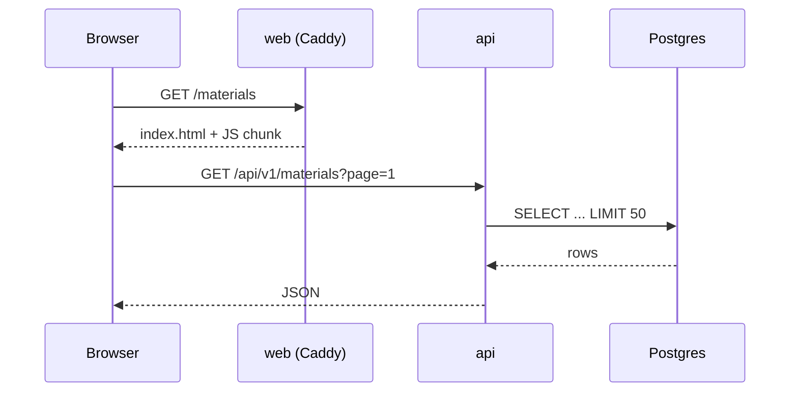
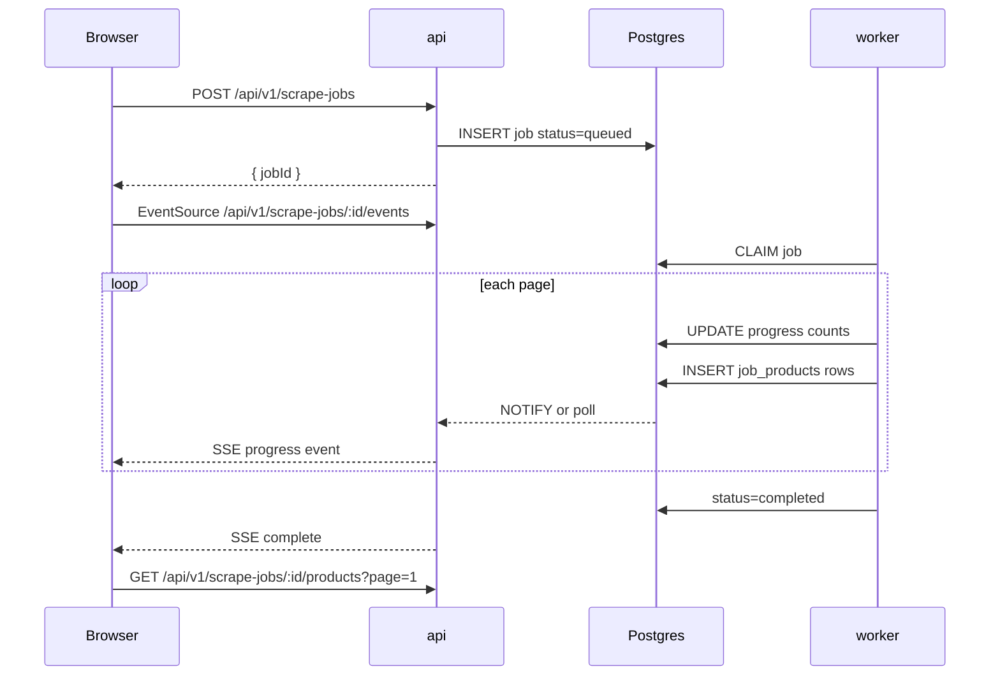

# 01 — Target architecture

## Executive summary

BidTool becomes **three cooperating processes** plus Postgres:

```
┌─────────────┐     ┌─────────────┐     ┌─────────────┐
│    web      │     │     api     │     │   worker    │
│  Vite SPA   │────▶│  Hono HTTP  │────▶│  jobs +     │
│  static     │     │  REST + SSE │     │  Playwright │
└─────────────┘     └──────┬──────┘     └──────┬──────┘
                           │                    │
                           └────────┬───────────┘
                                    ▼
                              PostgreSQL 16
```

- **web** — HTML/JS/CSS only. No server-side rendering required for the dashboard.
- **api** — All mutations and reads, short-lived requests, SSE fan-out for job progress.
- **worker** — Long-running scrape/import/export; never blocks API event loop.

This matches how the app is already used (single user, local or LAN, long background jobs) while leaving a credible path to multi-instance on-prem later.

---

## Process responsibilities

### `apps/web`

| Responsibility | Detail |
| --- | --- |
| UI rendering | React SPA, TanStack Router |
| Client state | TanStack Query caches, local storage for focused job IDs |
| Assets | Fonts, icons, static help content |
| API calls | `fetch` / generated client → `api` origin |
| Realtime | `EventSource` to `api` SSE endpoints |

**Does not:** run Playwright, hold DB pool for writes during scrape, execute migrations.

### `apps/api`

| Responsibility | Detail |
| --- | --- |
| HTTP API | REST JSON under `/api/v1/*` |
| Auth (future) | Middleware hook; no-op in single-user mode |
| DB reads/writes | Drizzle, connection pool `max: 10` per instance |
| Job control | Enqueue scrape/import; cancel via status flag |
| SSE hub | Subscribe clients to job channels |
| Health | `/api/health`, `/api/version` |
| Migrations | Run on startup when `BIDTOOL_RUN_MIGRATIONS=true` |

**Does not:** run Playwright, block for >30s on scrape (returns job ID immediately).

### `apps/worker`

| Responsibility | Detail |
| --- | --- |
| Poll queue | `FOR UPDATE SKIP LOCKED` on job tables |
| Scrape | `shop-material-scraper` (HTTP-first path) |
| Import | `shop-product-importer`, CSV/XLSX pipelines |
| Export (future) | Streaming material export jobs |
| Progress | Write counts to DB; emit events via `job_events` or NOTIFY |
| Browser pool | Dedicated Chromium lifecycle |

**Does not:** serve UI, handle user HTTP except optional internal health port.

---

## Request flows

### Typical page load (materials list)



### Shop scrape job



---

## Boundary rules

1. **No large blobs in hot paths** — `products` JSONB on job row is deprecated; use `shop_scrape_job_products`.
2. **Worker is sole Playwright owner** — `playwright` dependency only in `apps/worker`.
3. **Contracts are shared** — Zod schemas in `packages/contracts`; API validates in/out; web validates forms.
4. **Services are shared** — `packages/domain` or migrated `packages/server` holds BidWinner, material, scrape logic free of Hono/Next imports.
5. **Idempotent jobs** — Re-run safe; `job_id` + `source_url` uniqueness for scrape products.

---

## Comparison to current (Next.js monolith)

| Concern | Today | Option B |
| --- | --- | --- |
| UI delivery | Next RSC + client islands | Vite SPA chunks |
| API | tRPC batch stream | REST + OpenAPI |
| Background work | `instrumentation.ts` in Next process | `worker` process |
| Desktop | Electron spawns Next standalone | Electron spawns `api` + `worker`; web is static |
| Docker on-prem | 1 app container | `web` + `api` + `worker` |
| Progress | Full JSONB every 2s + client poll 1.5s | SSE + paginated product reads |
| Scale-out | Poor (in-memory scheduler) | API horizontal; single worker or leader election |

---

## Non-goals (v1 of Option B)

- Multi-tenant SaaS
- Redis / Kafka job bus
- GraphQL
- Replacing Postgres with SQLite
- Tauri desktop shell (possible later; see scalability doc)
- Rewriting scrape heuristics from scratch

---

## Architecture principles

1. **Optimize bytes and processes** — split before micro-optimizing regex.
2. **Same Postgres, clearer tables** — normalize hot JSONB paths.
3. **Fail isolated** — worker crash must not take down API.
4. **Deploy artifacts are small** — `web` is static files; API/worker are Node binaries.
5. **Migration is incremental** — strangler fig; see roadmap doc.

---

## Open decisions (resolve in Phase 0)

| ID | Question | Default recommendation |
| --- | --- | --- |
| D1 | REST vs keep tRPC on Hono | **REST + OpenAPI** for simpler Electron and future non-TS clients |
| D2 | Turborepo vs pnpm workspaces only | **Turborepo** — matches multi-app build |
| D3 | SSE vs WebSocket | **SSE** for one-way job progress |
| D4 | Monorepo in same repo vs `bidtoolv4` repo | **Same repo** on `architecture-option-b` branch until cutover |
| D5 | Version cutover | **v1.0.0** with migration guide; no dual-stack forever |

Record final choices in this file when Phase 0 closes.
