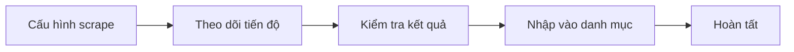

# 10 — UX/UI strategy

## Purpose

Define how BidTool should **look, feel, and behave** during and after the Option B migration. This is not a visual rebrand for its own sake — it aligns UI work with performance architecture (smaller chunks, SSE progress, paginated data) and fixes known usability gaps.

**Locale:** Vietnamese (`vi-VN`) primary. All new copy in Vietnamese unless technical labels (JSON-LD, DOM) are industry-standard.

---

## Product context

| Attribute | Implication for UX |
| --- | --- |
| Single-user local tool | No login flows; optimize for speed and clarity |
| Power users (procurement) | Dense tables OK; keyboard shortcuts valued |
| Long-running jobs (scrape/import) | Progress must be trustworthy and non-blocking |
| Mixed surfaces (web, on-prem, Electron) | Responsive layout; desktop window sizes 1280×800+ |
| Data quality issues (scrape) | UI must surface confidence, errors, and review before import |

---

## Design goals (Option B era)

1. **Clarity over density** — Break 3k-line screens into focused steps and panels.
2. **Progress you can trust** — Live job state via SSE; no “frozen” UI while work continues.
3. **Review before commit** — Scrape/import are destructive-adjacent; explicit confirm steps.
4. **Scan-friendly catalogs** — Materials list optimized for finding price, catalog PDF, source gaps.
5. **Consistent shell** — One navigation model, shared page headers, shared empty/loading/error patterns.
6. **Accessible by default** — Focus rings, labels, status announcements (see doc 13).

---

## Information architecture

### Primary nav (keep structure, tighten labels)

Align sidebar with mental model: **Discover → Catalog → Automate → System**.

| Section | Items | Notes |
| --- | --- | --- |
| **Tổng quan** | Dashboard | KPIs + recent activity |
| **Tìm & lưu** | Tìm kiếm, Bộ lọc & Watchlist | Merge “saved” concept in UI copy |
| **Danh mục** | Sản phẩm / vật tư, Catalog PDFs, Scrape shop (sub) | Scrape as child of materials, not orphan route |
| **Tự động hóa** | Quy trình, Thông báo | |
| **Hệ thống** | Cài đặt, Desktop, Trợ giúp | |

**IA change (recommended):**

```
/materials          → catalog hub
/materials/scrape   → scrape (unchanged path)
/materials/import   → import (unchanged)
/catalog-pdfs       → keep or nest under /materials/catalog-pdfs (phase 2)
```

Remove or redirect dead nav entries (`/import-mapping` → `/materials/import`) in UX pass.

### Page anatomy (standard template)

Every dashboard page follows:

```
┌─────────────────────────────────────────────────────────┐
│ Breadcrumb (optional)                                     │
│ Page title + short description                          │
│ Primary actions (right)                                 │
├─────────────────────────────────────────────────────────┤
│ Section nav chips (in-page anchors) — if multi-section    │
├─────────────────────────────────────────────────────────┤
│ Filters / summary strip (sticky on scroll for lists)      │
├─────────────────────────────────────────────────────────┤
│ Main content                                            │
└─────────────────────────────────────────────────────────┘
```

Reuse `page-section-nav.tsx` pattern; centralize in `packages/ui` as `PageHeader` + `PageSectionNav`.

---

## User journeys (priority)

### J1 — Scrape shop → review → import

**Today:** One enormous view; full product list repaints on poll.

**Target flow:**



| Step | UX focus |
| --- | --- |
| Configure | URL validation inline; presets (Giới hạn / Scrape hết); advanced collapsed |
| Monitor | SSE progress bar; pages/products counts; failed pages expandable |
| Review | Paginated table; filters (thiếu giá, có PDF, tên nghi vấn); row detail drawer |
| Import | Summary diff (tạo/cập nhật/bỏ qua); confirm dialog |
| Done | Link to materials filtered by import batch |

### J2 — Find material → fix price / attach catalog

**Gaps from product notes:** list doesn’t show catalog presence; “locked” fields unclear.

**Target:**

- Column/icon **Catalog PDF** (file icon + count)
- **Giá** column with status chip (đủ / thiếu / nhiều nguồn)
- Detail page: **locked fields** visually distinct (pin icon, muted edit, tooltip “Khóa để tránh ghi đè khi import”)

### J3 — Search tenders → save → workflow

Keep search density; improve save feedback (batch toast + saved-items link).

---

## UX problems to fix (from current feedback)

| Issue | UX response |
| --- | --- |
| Wrong scraped names / promo text (KH) | Review table: badge “Tên nghi vấn”; filter promo-like names; highlight in row |
| Missed null / empty products | Empty-state row policy: hide in review by default; toggle “Hiện dòng thiếu tên” |
| Page count scrape wrong | Progress shows **đã đọc / giới hạn / phát hiện** separately; tooltip explains stop reason |
| Catalog not visible in list | `hasCatalogPdf` column + filter |
| Locked important info | Locked field pattern on detail + bulk edit respects locks |

---

## Emotional tone & visual direction

**Not** generic “AI slop” purple gradients. **Keep** current direction:

- Light workspace (`app-bg` gradient, white panels)
- Teal/sky brand accents (`--brand-1`, `--brand-2`)
- Slate typography hierarchy
- Be Vietnam Pro (subset weights 400, 600, 700 in Option B)

**Evolution:**

- Slightly stronger card hierarchy for job monitors (left border accent by status)
- More `tabular-nums` on numeric columns
- Reduce visual noise in scrape review (fewer simultaneous panels)

---

## UX metrics (success criteria)

| Metric | Target |
| --- | --- |
| Time to start scrape (clicks from /materials) | ≤ 2 |
| Perceived progress latency (SSE) | < 3s |
| Materials list LCP (web) | < 2.5s |
| Scrape review: find row with missing price | ≤ 2 interactions (filter) |
| Task completion without help doc | Scrape + import first-time |
| WCAG 2.1 AA | Critical paths (forms, tables, dialogs) |

---

## Relationship to Option B engineering

| Engineering change | UX enabler |
| --- | --- |
| SSE job events | Real progress strip without full table flash |
| Paginated scrape products | Review step with virtualized table |
| Split scrape / enrich jobs | UI: “Bổ sung chi tiết sau” checkbox → second progress card |
| Smaller route chunks | Faster step transitions in multi-step scrape flow |
| `packages/ui` | Consistent buttons/badges across ported features |

---

## Deliverables (UX track)

| Artifact | Doc |
| --- | --- |
| Design tokens & components | [11 — Design system](./11-design-system.md) |
| Screen-by-screen specs | [12 — Screen specifications](./12-screen-specifications.md) |
| A11y & responsive | [13 — Accessibility & responsive](./13-accessibility-and-responsive.md) |
| Phased UX work | [14 — UX migration roadmap](./14-ux-migration-roadmap.md) |

---

## Optional: design tooling

| Tool | Use |
| --- | --- |
| Figma (light) | Shell + scrape flow wireframes before Phase 3 |
| Storybook | `packages/ui` component catalog |
| Visual regression | Playwright screenshots for dashboard + scrape |

Not required for Phase 0; recommended before Phase 3 scrape rewrite.

---

## Non-goals

- Dark mode (v1) — tokens structured to add later
- Full i18n / English UI
- Mobile-first redesign (responsive sufficient for tablet)
- Marketing landing site redesign
