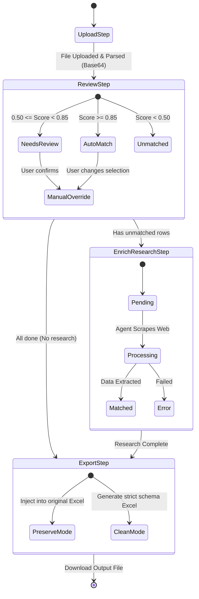

# Excel Enrichment & AI Matching (`/enrich`) - In-Depth Technical Documentation

This document exhaustively details the BOQ (Bill of Quantities) Excel enrichment pipeline. It covers deep mechanics of Base64 excel parsing, the multi-weighted fuzzy logic matching algorithm, fill-plan state machines, and the AI Web Research background processing flow.

---

## 1. Top Layer (UI & Workflows)

**Entry Point:** `src/app/(dashboard)/enrich/page.tsx`
**Client State Machine Component:** `<MaterialEnrichClient />` manages a 4-step progressive disclosure flow:



### 1.1 UI State Management
- `file` (File), `base64` (string), `preview` (EnrichPreview), `sheetName` (string)
- **`RowDecision` State Map:** Core state mapping a row index to the user's manual choices:
  ```typescript
  type RowDecision = {
    materialId: number | null;
    acceptedFields: Set<FillableField>; // Fields the user has ticked to overwrite
  };
  ```

### 1.2 Step Execution Flow
1. **Upload (`UploadStep`):** Converts `.xlsx` to Base64 using `FileReader.readAsDataURL`. Sends to `enrichPreviewXlsx`.
2. **Review & Match (`ReviewStep`):** Displays matches categorized into **Auto**, **Review**, and **Unmatched**. The `<MatchChooser />` UI lets users cycle through alternatives, search manually, and toggle `acceptedFields` checkboxes.
3. **Research (`EnrichResearchStep`):** Sends `unmatched` rows to the `excelResearch` TRPC router to generate an async background scraping job.
4. **Export (`ExportStep`):** Calls `enrichExportXlsx` passing the `decisions` map to generate a final downloaded Excel blob via `URL.createObjectURL`.

---

## 2. Excel Parsing Engine (`excel-workbook.ts`)

Powered by the `exceljs` library. Limits to `MAX_IMPORT_ROWS = 5000` and `MAX_IMPORT_COLS = 80` to prevent memory exhaustion on large files.

### 2.1 Dynamic Header Detection (`detectHeaderIndex`)
Scans the first 40 rows to detect the true header row.
- **Scoring System (`headerScore`):**
  - Mapped Name column (`materialName`) = +4 points.
  - Mapped Unit column (`unit`) = +2 points.
  - Mapped Quantity column (`qtyTotal`) = +2 points.
  - Each non-empty mapped column = +5 points.
  - Up to 8 non-empty cells = +1 point each.
- The row with the highest score becomes `activeHeaderRowIndex`.

### 2.2 Heuristic Column Mapping (`suggestColumnMapping`)
Uses predefined regex aliases to map raw Vietnamese text (normalized by stripping accents and symbols) to internal schema keys. Example aliases:
- `code`: `["ma", "ma vat tu", "sku", "item code"]`
- `materialName`: `["ten", "ten hang", "ten san pham", "product name"]`
- `qtyTotal`: `["so luong", "sl", "qty"]`
- `unitPrice`: `["don gia", "price", "budget"]`
- `vendorHint`: `["vendor", "nha cung cap", "nha san xuat"]`

---

## 3. Fuzzy Matching Algorithm (`ai-product-matcher.ts` & `excel-enrich.ts`)

Triggered via `enrichMatchRows`. The system maps raw Excel rows to `ScrapedShopProduct` interfaces and sends them to `findFuzzyCandidates`.

```mermaid
flowchart TD
    Start([Start Matching]) --> Normalize[Text Normalization Pipeline]
    
    Normalize --> N1(Strip Promos e.g., '[Khuyen mai]')
    N1 --> N2(Canonicalize Dimensions e.g., 'Ø21' -> '21mm')
    N2 --> N3(Remove Stop Words e.g., 'loai', 'chinh hang')
    N3 --> N4(Strip Brand from Name)
    N4 --> N5(Strip Accents via NFD)
    
    N5 --> SQL_DB[(PostgreSQL)]
    SQL_DB -->|pg_trgm ilike > 0.1 LIMIT 10| Candidates[Top 10 Candidates]
    
    Candidates --> Scoring{Compute Weighted Score}
    
    Scoring --> S1[Name Similarity: 30%]
    Scoring --> S2[Spec Match: 20%]
    Scoring --> S3[Brand Match: 20%]
    Scoring --> S4[Unit Match: 10%]
    Scoring --> S5[Origin Match: 10%]
    Scoring --> S6[Dimension Match: 10%]
    
    S1 & S2 & S3 & S4 & S5 & S6 --> TotalScore{Calculate Final Score}
    
    TotalScore -->|>= 0.85| AutoMatch(Auto Match)
    TotalScore -->|0.50 - 0.84| Review(Needs Review)
    TotalScore -->|< 0.50| Unmatched(Unmatched)
```

### 3.1 Text Normalization Pipeline (`normalizeProductName`)
1. **Strip Promos:** Removes bracketed prefixes (e.g., `[Khuyến mãi]`).
2. **Dimension Canonicalization:** Converts `Ø21`, `Phi 21`, `d21` to standardized `21mm` via RegEx.
3. **Stop Words:** Removes filler words: `"loại", "chính hãng", "cao cấp"`.
4. **Brand Stripping:** Dynamically identifies the manufacturer string inside the name and removes it, ensuring "Brand Match" and "Name Similarity" don't double count the same string.
5. **Accent Stripping:** Uses `string.normalize("NFD")`.

### 3.2 SQL Trigram Pre-Filtering
Uses `pg_trgm` via Drizzle:
```sql
SELECT m.*, similarity(m.name, ${searchName}) AS name_sim
FROM materials m WHERE similarity(m.name, ${searchName}) > 0.1
ORDER BY name_sim DESC LIMIT 10
```

### 3.3 Weighted Scoring Engine (`computeWeightedScore`)
Each of the 10 pre-filtered candidates is passed through a strict breakdown matrix to get a final score (0.0 to 1.0):
- **`nameSimilarity` (Weight 0.3):** Custom Jaccard similarity of 3-character trigrams on the normalized names.
- **`specMatch` (Weight 0.2):** 
  - Extracts numeric ranges via RegEx for Voltage (`v`), Wattage (`w`), Amperage (`a`), Weight (`kg/g`), Capacity (`lít/ml`), and Temp (`c`).
  - Calculates numerical intersection. If no numbers, falls back to token overlap.
- **`manufacturerMatch` (Weight 0.2):** Uses a canonical dictionary (`BRAND_ALIASES`: `"hoa sen" -> ["hsg", "ton hoa sen"]`). Checks inclusion (`na.includes(nb)` = 0.9 score).
- **`unitMatch` (Weight 0.1):** Strict string match after mapping aliases (`"cái" == "chiếc"`).
- **`originMatch` (Weight 0.1):** Dictionary mapping (`"vn" -> "vietnam"`).
- **`dimensionMatch` (Weight 0.1):** Regex extraction of floats near measurement keywords.

### 3.4 Classification Thresholds
- **Auto-Match:** Score `>= 0.85`.
- **Needs Review:** Score `0.50` to `0.84`.
- **Unmatched:** Score `< 0.50`.

---

## 4. Fill Plan Architecture (`buildFillPlan`)

For a selected candidate, the engine compares `FILLABLE_FIELDS` against the raw Excel cell data.
Returns a `FillPlanCell` object with an `action`:
- `"filled"`: Excel was empty, Material DB has a value.
- `"kept"`: Excel already has a value, DB value is ignored by default to preserve user data.
- `"overwritten"`: User clicked the override checkbox.
- `"missing-both"`: Neither source has data.

---

## 5. Excel Generation Engine (`writeEnrichedWorkbook`)

- **Preserve Mode (`writePreservedWorkbook`):**
  - Mutates the original Base64 payload.
  - Reads `opts.decisions` mapped to `originalRowIndex`.
  - Only writes to cells that have an action of `"filled"` or `"overwritten"`.
  - Dynamic Column Injection: If the Material requires writing to a field (e.g., `originCountry`) but the original Excel lacked an "Origin" column, the script automatically adds a new column header `APPENDED_HEADER_LABEL['originCountry']` (e.g. "Xuất xứ") to the far right of the sheet bounds.
- **Clean Mode (`writeCleanWorkbook`):**
  - Generates a `new ExcelJS.Workbook()`.
  - Ignores all original Excel styling/data.
  - Dumps matched materials in a strict canonical layout (`CLEAN_COLUMN_ORDER`).

---

## 6. AI Web Research Job Subsystem (`excel-research.ts`)

A sophisticated background agent workflow for `unmatched` rows.

### 6.1 Database State Flow (`excelWorkspaceItems.matchStatus`)
Statuses: `pending -> processing -> matched | needs_review | error`

### 6.2 Agent Execution (`processJobBatchDetailed`)
1. Fetches an uncompleted batch.
2. Formats a search query: `[ProductName] [SpecText] [VendorHint]`.
3. Calls out to an LLM provider (e.g. Gemini/Claude) combined with search tools (SerpApi/SearXNG).
4. The agent attempts to parse supplier websites, extracting the Price, Manufacturer, Spec, and Source URL.
5. Saves results to `webProductCandidates`.
6. Triggers a front-end UI update indicating rows are ready for review.
