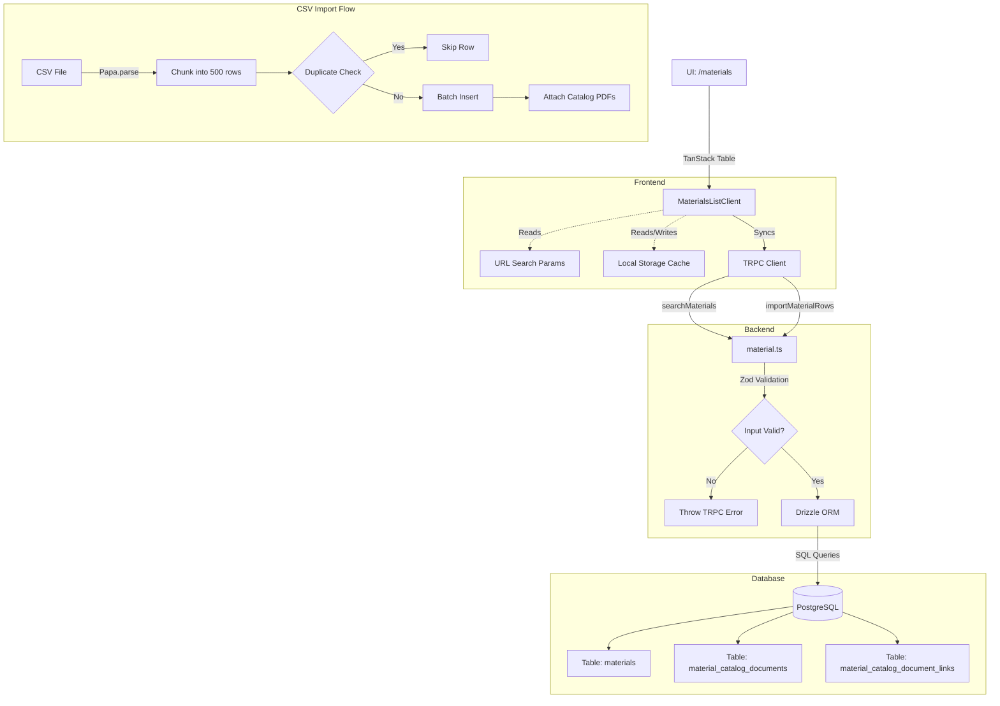
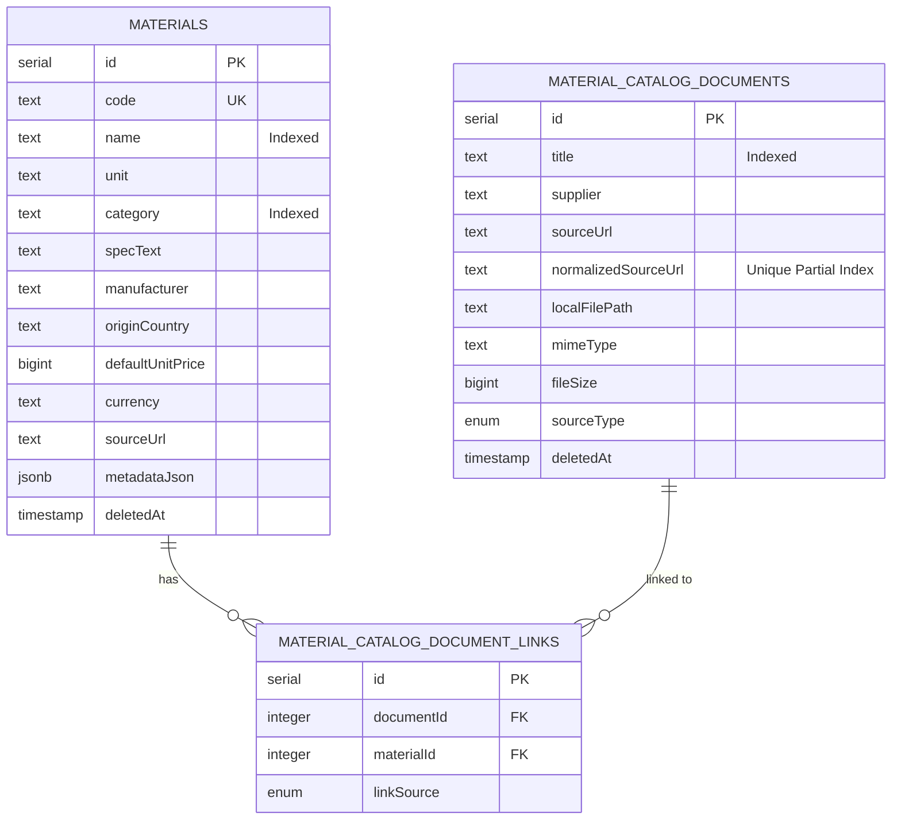

# Material Catalog Management (`/materials`) - In-Depth Technical Documentation

This document provides an exhaustive, granular technical overview of the Material Catalog feature within BidTool v3. It covers the UI layer, backend TRPC APIs, data structures, Zod validations, indexing strategies, and core workflows used to manage construction materials and their price sources.

---

## 1. Architecture & Flow Overview

## 2. Top Layer (UI & Client Logic)

**Entry Points:** 
- List View: `src/app/(dashboard)/materials/page.tsx`
- Detail View: `src/app/(dashboard)/materials/[id]/page.tsx`

**Main Client Component:** `<MaterialsListClient />` (`src/app/_components/materials/list-client.tsx`)

### 2.1 State Management & Persistence
The client side is heavily optimized for rendering large catalogs using `@tanstack/react-table`.
- **URL Search Params Syncing:** Filter states are synchronized tightly with the URL (`?q=thep&price=missing&sort=updatedAt&order=desc&page=1&pageSize=50`) using `window.history.replaceState`. This ensures that refresh, back navigation, and deep-linking behave natively.
- **Local Storage Cache:** 
  - `bidtool:material-catalog-columns:v1`: Caches an object implementing TanStack Table's `VisibilityState` to remember which columns the user hid.
  - `bidtool:material-catalog-density:v1`: String cache (`comfortable` vs `compact`) determining padding and font sizes in table cells.
- **React Optimizations:** Uses `useDeferredValue(keyword)` to debounce text input typing so the TRPC query hook (`materialsQuery`) doesn't fire excessively, preventing main thread blocking during fast typing.

### 2.2 Data Hydration & Enrichment (`enrichMaterialRow`)
Materials fetched from the API are mapped through `enrichMaterialRow` before rendering:
- **Source Counting:** Calculates `sourceCount` by standardizing the `metadataJson.priceSources` array. If a legacy `sourceUrl` exists on the material level that doesn't match a URL inside `priceSources`, it increments the count by 1.
- **Details String:** Compiles a formatted `details` string (e.g., `"Mã SP01 • Nhóm Thép • 3 nguồn • 1 catalog PDF"`) dynamically from row data.

---

## 3. Middle Layer (Validation & TRPC Endpoints)

**Router Definition:** `materialRouter` (`src/server/api/routers/material.ts`)

### 3.1 Zod Schemas & Data Validation
All inputs are strictly validated.
- **`materialInput`:**
  - `name`, `unit`: Required strings (`min(1)`).
  - `defaultUnitPrice`: Optional, nullable, non-negative number.
  - `currency`: Defaults to `"VND"`.
  - `code`, `category`, `specText`, `manufacturer`, `originCountry`, `sourceUrl`: Optional, trimmed strings.
- **`materialSearchFiltersInput`:**
  - `priceStatus`: `"all" | "priced" | "missing"`
  - `sourceStatus`: `"all" | "with" | "without"`
  - `catalogStatus`: `"all" | "with" | "without"`

### 3.2 Advanced Search & Filtering Query (`searchMaterials`)
The read query dynamically builds Drizzle `WHERE` clauses (`materialFilterConditions`):
- **Fuzzy Search:** Uses `ilike(%, keyword, %)` across `name`, `code`, `unit`, `category`, `specText`, `manufacturer`, and `originCountry`.
- **Price Source Querying:** 
  - `sourceStatus === "with"`: Uses raw SQL `sql`jsonb_array_length(case when jsonb_typeof(${materials.metadataJson}->'priceSources') = 'array' then ${materials.metadataJson}->'priceSources' else '[]'::jsonb end) > 0`` OR `sourceUrl` is not null.
- **Catalog Status:** Uses a correlated SQL `EXISTS` subquery against `material_catalog_document_links`.
- **Pagination:** Handles `limit` (max 10,000 for exports) and `offset`.

### 3.3 Bulk Material Import (`importMaterialRows`)
- **Parsing:** Uses `Papa.parse` to read CSV payloads with `transformHeader` to lowercase headers.
- **Idempotency (Duplicate Prevention):** Before insertion, it pulls existing codes and builds an `importNameUnitKey` (format: `name.toLowerCase()|unit.toLowerCase()`). It skips incoming rows that collide with these keys.
- **Batching:** Drizzle `insert` operations are chunked into batches of 500 records to prevent PostgreSQL query size limits.
- **Catalog PDF Fallback:** Safely tries to execute `attachCatalogPdfUrlsToMaterial()` within a try/catch block so a broken URL doesn't fail the entire row insertion.

### 3.4 Price Sources Logic
A material can have multiple price sources stored inside `metadataJson.priceSources`.
- **Modes:** `linked` (must have `url`) or `fixed` (must have `fixedPrice`).
- **Primary Enforcement:** Handled by `normalizePrimarySources`, ensuring exactly one source has `isPrimary = true`. If a primary source is updated, its price automatically propagates to the root `materials.defaultUnitPrice`.

---

## 4. Data Layer (Database Schema)

The database schema (`src/server/db/schema.ts`) uses PostgreSQL.

### 4.1 `materials` Table
- `id`: `serial` primary key.
- `code`: `text`. Indexed with a `uniqueIndex` named `materials_code_unique` that applies a `WHERE deleted_at IS NULL` partial index rule to allow deleting and reusing codes.
- `name`: `text`, standard b-tree index.
- `unit`: `text`
- `category`: `text`, standard b-tree index.
- `specText`: `text`, default `""`.
- `manufacturer`, `originCountry`: `text`
- `defaultUnitPrice`: `bigint` (using Drizzle's `{ mode: "number" }` to cast to JS numbers).
- `currency`: `text` default `VND`.
- `metadataJson`: `jsonb` field. Defaults to `{}`. Used for schema-less data like `priceSources`.
- `deletedAt`: `timestamp`. System uses Soft Deletes everywhere.

### 4.2 Catalog Documents
- **`material_catalog_documents`**: Stores parsed PDF metadata.
  - `mimeType`, `fileSize`, `checksum`.
  - `sourceType`: Enum (`"uploaded"`, `"detected"`, `"manual_url"`).
  - `normalizedSourceUrl`: Used for a unique partial index to prevent re-scraping the exact same PDF URL.
- **`material_catalog_document_links`**: Many-to-many join table between `materials` and `material_catalog_documents`. Unique index on `(document_id, material_id)`.
