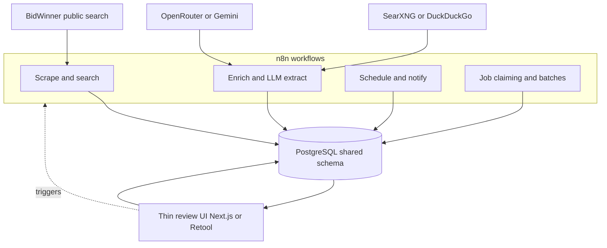
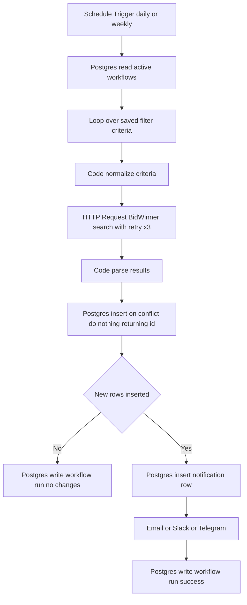
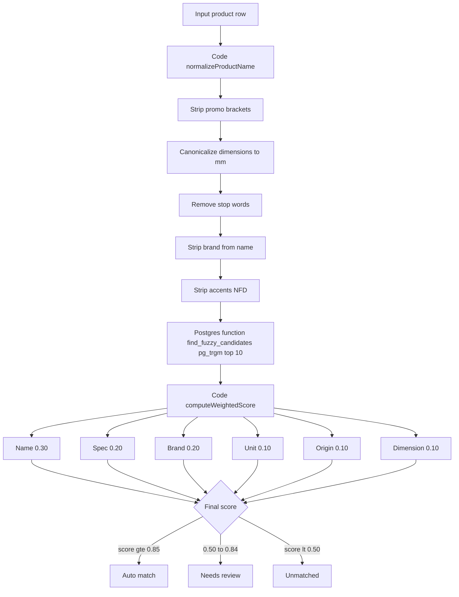
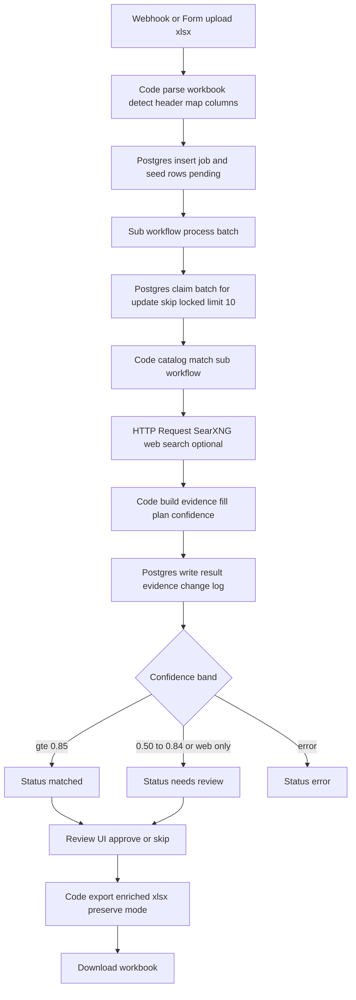
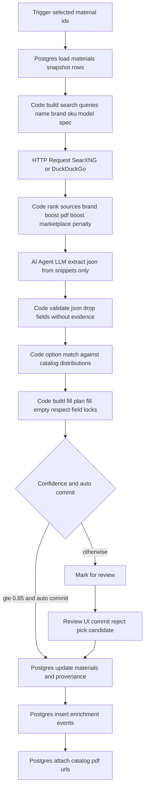
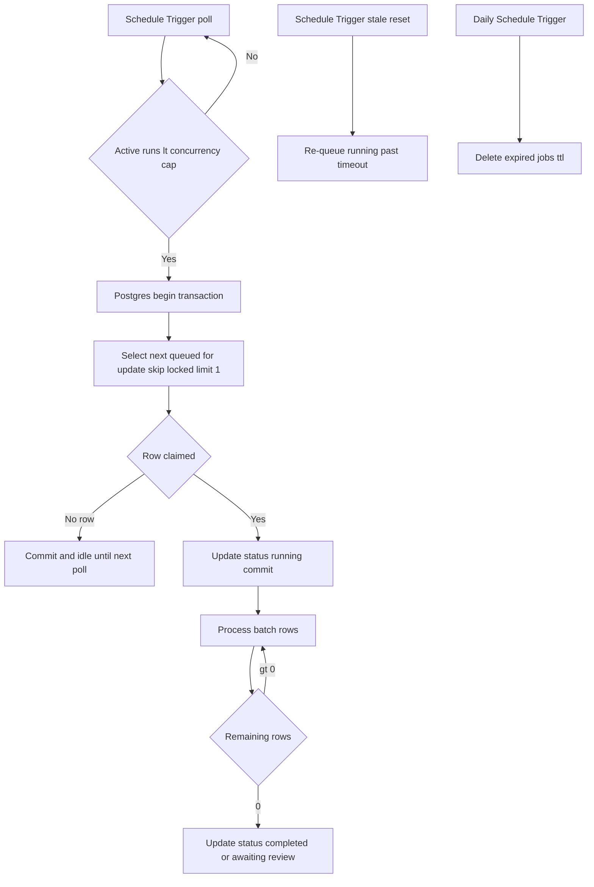

# Rebuilding BidTool v3 in n8n — Logic Review & Feasibility

> Status: Analysis (June 2026)
> Scope: Reviews the current app's logic and functions, then assesses what can be recreated in n8n and how.

This document does two things:

1. Reviews the real logic and functions in BidTool v3 (what the app actually does today).
2. Assesses, feature by feature, whether n8n can recreate it — and gives concrete build recipes (nodes, flow, data model) where it can.

---

## 1. What BidTool v3 is (current architecture)

BidTool v3 is a single-user local dashboard for Vietnamese tender (BidWinner) discovery, a construction material catalog, and Excel/BOQ enrichment workflows.

- Stack: Next.js 15 (App Router) + tRPC v11 + Drizzle ORM + PostgreSQL + Tailwind.
- Runtimes: Vercel (web), on-prem Docker (Caddy + app + Postgres), and Electron desktop.
- Single-user: no auth, sessions, or ownership columns by design.
- UI copy is Vietnamese (`vi-VN`).
- Excel parsing via `exceljs`; CSV via `papaparse`; web scraping via `playwright`.
- AI via OpenRouter / Gemini / OpenAI-compatible providers; web search via SearXNG or DuckDuckGo HTML.

### Core building blocks

| Layer | Where | Role |
|-------|-------|------|
| UI | `src/app/(dashboard)/**` | 4-step wizards, tables, review panels |
| API | `src/server/api/routers/*` | tRPC routers (typed RPC over HTTP) |
| Services | `src/server/services/*` | Scraping, matching, enrichment, jobs |
| Jobs | `src/server/services/job-scheduler.ts` | In-process durable job queue |
| Data | `src/server/db/schema.ts` | Postgres schema (Drizzle) |

### tRPC routers (the functional surface)

| Router | Responsibility |
|--------|----------------|
| `search` | BidWinner live search (packages/plans/projects), saved filters ("Smart Views"), save results to DB |
| `watchlist` | Track packages/plans/projects/inviters/competitors/commodities |
| `workflow` | Saved-filter-driven triggers + notifications + run history |
| `notification` | In-app notifications |
| `material` | Material catalog CRUD, advanced search, CSV import, price sources |
| `catalogDocument` | Catalog PDF documents + material links |
| `excelResearch` | Excel upload → durable research job → review → export `.xlsx` |
| `materialEnrichment` | Select catalog rows → durable web-research job → commit to DB |
| `ai` | Provider config (OpenRouter/Gemini/OpenAI-compatible) + chat |
| `version` | App version / release info |

---

## 2. Feature-by-feature logic review

### 2.1 Tender discovery (BidWinner search) — `searchRouter`

What it does:
- Queries `bidwinner.info` public endpoints live (`queryBidWinnerPublicSearch`) across 5 modes: `package_keyword`, `package_location`, `package_area_location`, `plan`, `project`.
- Normalizes criteria (keyword, provinces, categories, budget range, date range, min match score) via `normalizeSearchCriteria`.
- Scrapes / parses HTML+JSON pages with retry (`MAX_FETCH_ATTEMPTS = 3`), a page cache, and graceful fallback returning an empty result set with a warning on source instability.
- `getPackageDetails` / `getSourceDetails` fetch a single tender's detail page on demand.
- `saveSelectedResults` upserts chosen packages/plans/projects into `tender_packages`, `tender_plans`, `investment_projects` (dedup by `externalId`).
- Saved filters ("Smart Views") persist criteria as `criteriaJson` with legacy column mirroring + schema-drift detection.

Key logic details:
- Budget and date range validation with Zod `.refine()` (min ≤ max).
- Province canonicalization and key normalization for fuzzy province matching.
- Local refinement: some filter fields are applied client/local-side when the source can't filter exactly.

### 2.2 Watchlist + Workflows + Notifications

- `watchlist`: idempotent add (dedupe on `type`+`refKey`), list, bulk remove.
- `workflow`: create from scratch or from a saved filter; trigger types `new_package | new_search_result | schedule`; action types `in_app | email`. `runNow` writes a `workflow_runs` row + a `notifications` row in one transaction. Note: `runNow` today is essentially a stub — it records a successful run and emits a notification but does not actually re-query the source and diff for new results.
- `notification`: in-app notification feed.

### 2.3 Material catalog — `materialRouter`

- TanStack Table UI with URL-synced filters and localStorage column/density caches.
- `searchMaterials`: dynamic Drizzle WHERE builder — fuzzy `ilike` across many columns, price/source/catalog status filters (incl. correlated `EXISTS` subquery and `jsonb_array_length` checks), pagination (limit up to 10k for export).
- `importMaterialRows`: CSV via `papaparse`, lowercased headers, dedupe on `name|unit` key + existing codes, batched inserts (500/chunk), best-effort catalog-PDF attach per row.
- Price sources: stored in `metadata_json.priceSources`, modes `linked`/`fixed`, exactly one primary enforced; primary price propagates to `defaultUnitPrice`.
- Soft deletes everywhere (`deletedAt`); unique partial index on `code WHERE deleted_at IS NULL`.

### 2.4 Fuzzy product matching engine (the "brain")

Used by both Excel enrichment and material enrichment. Lives in `ai-product-matcher.ts` / `excel-enrich.ts`.

Pipeline:
1. Text normalization (`normalizeProductName`): strip promo brackets, canonicalize dimensions (`Ø21`/`Phi 21`/`d21` → `21mm`), remove stop words, strip brand from name, strip accents (NFD).
2. SQL trigram pre-filter: `pg_trgm` `similarity(name, query) > 0.1 ORDER BY sim DESC LIMIT 10`.
3. Weighted scoring (`computeWeightedScore`, 0.0–1.0):
   - name similarity 0.30 (trigram Jaccard)
   - spec match 0.20 (numeric ranges for V/W/A/kg/L/°C, else token overlap)
   - manufacturer match 0.20 (brand alias dictionary)
   - unit match 0.10 (alias map)
   - origin match 0.10 (dictionary)
   - dimension match 0.10 (regex near measurement keywords)
4. Classification: ≥ 0.85 auto-match, 0.50–0.84 needs review, < 0.50 unmatched.

This is deterministic, DB-backed, and relies on Postgres `pg_trgm`. It is the single hardest piece to reproduce faithfully outside the app.

### 2.5 Excel research jobs — `excelResearchRouter`

Flow: upload `.xlsx` → `createJob` (persist original + seed rows) → `startJob` → batch loop (`processJobBatch`, claims rows with `FOR UPDATE SKIP LOCKED`) → per-row pipeline (catalog match + optional SearXNG web search → evidence + fill plan + confidence) → review UI (approve/skip) → `exportExcel`.

Durability: 5 tables (`excel_research_jobs`, `_job_rows`, `_row_evidence`, `_file_artifacts`, `_change_log`). Append-only change log. Jobs resume after restart via `fillExcelResearchSlots()`.

Fill semantics: only blank cells filled; preserve-mode export mutates the original workbook and can append missing columns; clean-mode export writes a canonical layout.

### 2.6 Material web enrichment — `materialEnrichmentRouter`

Flow: select catalog rows → `startMaterialEnrichmentJob` → scheduler runs per material: snapshot row → build queries (name/manufacturer/SKU/model/spec) → DuckDuckGo/SearXNG search + rank sources → save candidates → OpenRouter LLM extracts fields from snippets only → match against existing catalog option distributions → fill plan + confidence → optional auto-commit → review UI → commit to `materials` (fill-empty, field locks respected) + attach catalog PDFs + audit events.

Division of labor: the LLM decides what matches; the app decides what gets written (validation, fill-empty, field locks, DB writes). Confidence bands: ≥0.85 auto, 0.5–0.85 review, <0.5 skip.

### 2.7 Job scheduler — `job-scheduler.ts`

In-process queue (not serverless): polls every 1s, fills slots for scrape/import/enrichment/excel-research up to per-type concurrency caps, claims jobs transactionally with `FOR UPDATE SKIP LOCKED`, throttles progress writes (~2s), resets stale `running` jobs to `queued` on restart, and TTL-cleans expired jobs hourly. Requires a long-running Node process.

### 2.8 Shop scraping — `shop-material-scraper.ts`

Playwright-driven crawl of a single shop URL (json_ld or dom_cards), pagination within the same domain, product/page caps, optional detail enrichment, promo-badge sanitization, then import into the catalog with dedup.

### 2.9 AI provider abstraction — `aiRouter` + `app-settings.ts`

Pluggable providers (OpenRouter, Gemini, OpenAI-compatible), per-feature active provider (`chat` vs `enrichment`), keys stored in DB settings or locked by env vars, connection test, and a chat endpoint.

---

## 3. Can you recreate this in n8n? Short answer

**Partially — and it depends what you mean by "recreate."**

n8n is an excellent fit for the **backend automation and pipelines**: scheduled tender scraping, web search, LLM extraction, Postgres reads/writes, Excel parsing/generation, notifications, and the durable "job" orchestration. These map almost 1:1 to n8n nodes.

n8n is a **poor fit for the interactive UI**: the 4-step wizards, the row-by-row review panels, the TanStack tables, manual match overrides, the match chooser, and column toggles. n8n has Forms and a chat trigger, but it is not a CRUD app builder. You would still need a thin frontend (or a tool like Appsmith/Retool/Budibase, or keep the Next.js UI) for human review steps.

So the realistic target is a **hybrid**: n8n owns the workflows/pipelines; a lightweight UI (or n8n Forms for simple cases) owns human review. The same Postgres database is the shared backbone.

### Feasibility matrix

| Feature | n8n fit | Notes |
|---------|:------:|-------|
| Scheduled tender search + diff + notify | High | Schedule Trigger + HTTP + Postgres + dedup. Replaces the stubbed `workflow.runNow`. |
| BidWinner scraping (HTML/JSON pages) | Medium | HTTP Request + HTML/Code nodes work; heavy JS pages need a headless-browser node/service. |
| Notifications (email/Slack/Telegram/in-app) | High | Native nodes; "in-app" = write to a Postgres table the UI reads. |
| Material catalog CRUD | Low | n8n is not a table UI. Keep app UI or use Retool/Appsmith. |
| CSV import (dedupe, batch) | High | Read Binary + Spreadsheet File + Postgres, with Code-node dedup. |
| Fuzzy product matching (pg_trgm + weighted) | Medium | Reproducible in a Postgres function + Code node; effort is non-trivial. |
| Excel research job (catalog + web) | High (pipeline) / Low (review UI) | Pipeline maps well; review needs UI or Forms. |
| Material web enrichment (search + LLM extract + commit) | High (pipeline) / Low (review UI) | LLM extraction is n8n's sweet spot. |
| Durable job queue / concurrency / resume | Medium | n8n has queue mode, retries, and executions, but `FOR UPDATE SKIP LOCKED` row-claiming you implement via Postgres. |
| Excel generation (preserve original styling) | Low–Medium | n8n Spreadsheet node writes new files; "preserve original workbook + append columns" needs a Code node with a JS xlsx lib or an external function. |
| AI chat assistant | High | Chat Trigger + AI Agent + model nodes. |
| Typed end-to-end app (tRPC) | N/A | Not n8n's model; replaced by workflows + DB. |

---

## 4. Target hybrid architecture in n8n

```
                ┌─────────────────────────────────────────────┐
                │                  PostgreSQL                   │
                │  (same schema: materials, jobs, evidence,     │
                │   tenders, notifications, settings)           │
                └───────────────▲───────────────▲──────────────┘
                                │               │
        ┌───────────────────────┘               └───────────────────────┐
        │                                                                │
┌───────────────┐   triggers/pipelines               human review        ┌──────────────────┐
│      n8n      │◀──────────────────────────────────────────────────────▶│  Thin review UI  │
│  workflows    │   webhooks / Forms                                       │ (Next.js / Retool│
│ (scrape, search,                                                          │  / Appsmith)     │
│  enrich, LLM, │                                                          └──────────────────┘
│  notify, jobs)│
└───────────────┘
        │
        ├── HTTP Request (BidWinner, SearXNG/DuckDuckGo)
        ├── AI Agent / OpenRouter / Gemini nodes (extraction, chat)
        ├── Postgres node (CRUD, job claiming, evidence)
        └── Spreadsheet File / Code node (xlsx parse + generate)
```

Same architecture as a Mermaid graph:



Principles:
- Postgres stays the single source of truth (reuse the existing schema).
- n8n replaces `src/server/services/*` + `job-scheduler.ts` + cron-like workflows.
- A thin UI replaces `src/app/**` review screens. For simple approve/reject, n8n **Forms** + **Wait** nodes can suffice.

---

## 5. Build recipes (how to do it in n8n)

### 5.1 Scheduled tender search + new-result notifications

This is the highest-value, cleanest win — and it actually *completes* the stubbed `workflow.runNow`.

Workflow nodes:
1. **Schedule Trigger** (e.g., daily/weekly per saved filter's `notificationFrequency`).
2. **Postgres** — read active workflows / saved filters (`SELECT * FROM workflows WHERE is_active = true`).
3. **Split In Batches / Loop** over each saved filter's criteria.
4. **HTTP Request** — call BidWinner public search endpoints (mirror `queryBidWinnerPublicSearch` URL + params). Add retry (n8n node "Retry On Fail", up to 3) to match `MAX_FETCH_ATTEMPTS`.
5. **Code** — normalize criteria + parse results (port `normalizeSearchCriteria`).
6. **Postgres** — upsert into `tender_packages` / `tender_plans` / `investment_projects`, dedupe on `external_id` (use `INSERT ... ON CONFLICT (external_id) DO NOTHING RETURNING id` to detect truly-new rows).
7. **IF** — only continue when new rows were inserted.
8. **Postgres** — insert a `notifications` row (the "in-app" channel the UI reads).
9. **Email / Slack / Telegram** node — for external channels.
10. **Postgres** — insert a `workflow_runs` row with status + message.

Result: real new-result detection (the current app only stubs this), with the same DB tables.



### 5.2 BidWinner scraping

- For JSON/HTML endpoints: **HTTP Request** + **HTML Extract** / **Code** nodes. Set the same headers (`User-Agent`, `Accept-Language: vi-VN`, `Referer`).
- For JS-rendered pages: n8n has no built-in Playwright. Options:
  - Run a small **Playwright/Puppeleer microservice** and call it via HTTP Request, or
  - Use a community node (e.g., `n8n-nodes-puppeteer`) on a self-hosted instance, or
  - Use a scraping API (Browserless, ScrapingBee, Apify).
- Cache pages in a Postgres table (mirror `bidwinner-page-cache.ts`) keyed by URL + TTL.

### 5.3 Material CSV import

1. **Form Trigger** (file upload) or **Read Binary File**.
2. **Spreadsheet File** node (parses CSV) → rows as items.
3. **Code** — lowercase headers, build `name|unit` dedup key.
4. **Postgres** — fetch existing codes + name|unit keys; filter out collisions.
5. **Postgres** (batched insert) — n8n batches naturally per item; for 500-row chunks use Split In Batches.
6. **HTTP/Code** — best-effort catalog-PDF attach (wrap in continue-on-fail).

### 5.4 Fuzzy product matching (pg_trgm + weighted score)

Recommended approach: push the heavy part into Postgres so n8n stays thin.

1. Ensure `CREATE EXTENSION pg_trgm;` and a trigram index on `materials.name`.
2. Create a **Postgres function** `find_fuzzy_candidates(search_name text)` that returns the top-10 by `similarity()` (ports section 3.2 of `docs/enrich.md`).
3. **Postgres** node calls the function per row.
4. **Code** node computes the weighted score (port `computeWeightedScore`: name 0.30, spec 0.20, brand 0.20, unit 0.10, origin 0.10, dimension 0.10) and applies thresholds (≥0.85 auto, 0.50–0.84 review, <0.50 unmatched). Include the brand-alias and unit-alias dictionaries inline.

This is faithful but is the most code you'll hand-port. Keep the JS for `normalizeProductName` and `computeWeightedScore` verbatim in a Code node.



### 5.5 Excel research job (catalog + web)

Pipeline workflow (triggered by upload webhook/Form):
1. **Webhook / Form Trigger** — receive `.xlsx`.
2. **Spreadsheet File** / **Code (exceljs via Code node)** — parse, detect header row, suggest column mapping (port `excel-workbook.ts`).
3. **Postgres** — `INSERT` job + one row per data row (statuses `pending`).
4. **Sub-workflow "process batch"** (called on a schedule or immediately):
   - claim rows: `UPDATE ... WHERE id IN (SELECT id ... WHERE status='pending' FOR UPDATE SKIP LOCKED LIMIT 10) RETURNING *`.
   - per row: call matching sub-workflow (5.4) + optional **HTTP Request** to SearXNG (`GET {base}/search?q=…&format=json`).
   - write `result_json`, `fill_plan_json`, evidence rows, change-log rows.
   - set status `matched` / `needs_review` / `error`.
5. **Review** — see section 6.
6. **Export** — **Code** node with a JS xlsx library to write the enriched workbook (preserve-mode = mutate original buffer + append missing columns; this is the trickiest node — `exceljs` inside a Code node is the closest match).



### 5.6 Material web enrichment (LLM extraction → DB commit)

This is n8n's strongest use case.
1. **Trigger** — webhook with selected material IDs (or schedule over a "queued" table).
2. **Postgres** — load materials + snapshot original rows.
3. **Code** — build search queries (name, manufacturer, SKU, model, spec).
4. **HTTP Request** — SearXNG or DuckDuckGo HTML; **Code** ranks sources (manufacturer-domain boost, `.pdf` boost, marketplace penalty — port `material-web-search.ts`).
5. **AI Agent / OpenRouter node** — strict JSON-only extraction prompt; LLM may only cite provided snippets (port `material-enrichment-extract.ts`).
6. **Code** — validate JSON, drop fields without evidence, match against existing catalog option distributions (port `option-matcher.ts`), build fill plan (fill-empty, respect `metadata_json.fieldLocks`), compute confidence.
7. **IF** — confidence ≥ 0.85 and auto-commit enabled → **Postgres** update `materials` + write `metadata_json.webEnrichment` provenance + insert `material_enrichment_events`. Else → mark for review.
8. **Postgres** — attach detected catalog PDF URLs.



### 5.7 Durable jobs / concurrency / resume

- Enable n8n **queue mode** (Redis-backed) for concurrency and reliability.
- Implement row-claiming with `FOR UPDATE SKIP LOCKED` in Postgres nodes (same pattern the app uses).
- Resume-after-restart: a Schedule Trigger that re-queues rows stuck in `running` past a timeout (mirrors `resetStaleRunningJobs` / `resetStaleExcelResearchRows`).
- TTL cleanup: a daily Schedule Trigger deleting expired jobs (mirrors `cleanupExpiredJobs`).
- Progress throttling is mostly unnecessary in n8n; write progress per batch instead of per row.



### 5.8 AI chat assistant

- **Chat Trigger** + **AI Agent** node + model node (OpenRouter/Gemini/OpenAI-compatible).
- Store provider config in the same `app_settings` table; read it with a Postgres node and pass into the model node credentials.

---

## 6. The hard part: human review UI

The app's review steps (match chooser, per-field accept checkboxes, evidence panels, bulk commit) have no clean n8n equivalent. Choose one:

| Option | Effort | Fidelity | When |
|--------|--------|----------|------|
| Keep the Next.js UI, point it at the same DB; let n8n own pipelines | Medium | High | Best balance; reuse existing review screens |
| n8n **Forms + Wait** nodes (approve/reject + pick candidate) | Low | Low–Medium | Simple linear approvals, low volume |
| Low-code app builder (Retool / Appsmith / Budibase) over the same DB | Medium | Medium–High | Want to drop Next.js but keep rich tables |
| Build review UI from scratch | High | High | Only if abandoning the existing app entirely |

Recommendation: keep BidTool's existing review UI and DB; move the *background work* (search, scrape, enrich, notify, schedule) into n8n. That captures most of n8n's benefit (visual, debuggable, schedulable pipelines) without losing the interactive screens that n8n can't replicate.

---

## 7. What you gain and lose

Gains with n8n:
- Visual, debuggable pipelines with per-node execution history and retries.
- Built-in scheduling, queue mode, and a huge node/integration catalog (email, Slack, Telegram, LLMs).
- Non-developers can tweak workflows; the stubbed `workflow.runNow` becomes a real diff-and-notify pipeline.

Losses / costs vs the current app:
- No typed end-to-end contract (tRPC + Zod). Validation must be re-implemented in Code nodes.
- No rich interactive UI; review still needs a frontend.
- Excel preserve-mode export and the weighted matcher are non-trivial hand-ports.
- Headless-browser scraping needs an external service.
- Single-binary desktop/Electron + on-prem packaging story is lost; n8n is its own deployment.

---

## 8. Suggested migration path (incremental)

1. Stand up self-hosted n8n + point it at the existing Postgres (read-only first).
2. Build the **scheduled tender search + notify** workflow (5.1) — immediate value, replaces the stub, low risk.
3. Move **material web enrichment** pipeline (5.6) into n8n; keep the app's review UI.
4. Move **Excel research** pipeline (5.5); keep the app's wizard for upload + review.
5. Port the **fuzzy matcher** into a Postgres function + Code node (5.4) and share it across both pipelines.
6. Optionally migrate scraping (5.2) once a headless-browser service is in place.
7. Decide whether to keep Next.js purely as the review/CRUD UI, or replace it with Retool/Appsmith.

Bottom line: recreate the **automation and pipelines** in n8n (high value, good fit), but keep a thin UI — ideally the existing Next.js app — for the human-in-the-loop review steps that n8n cannot reproduce.
