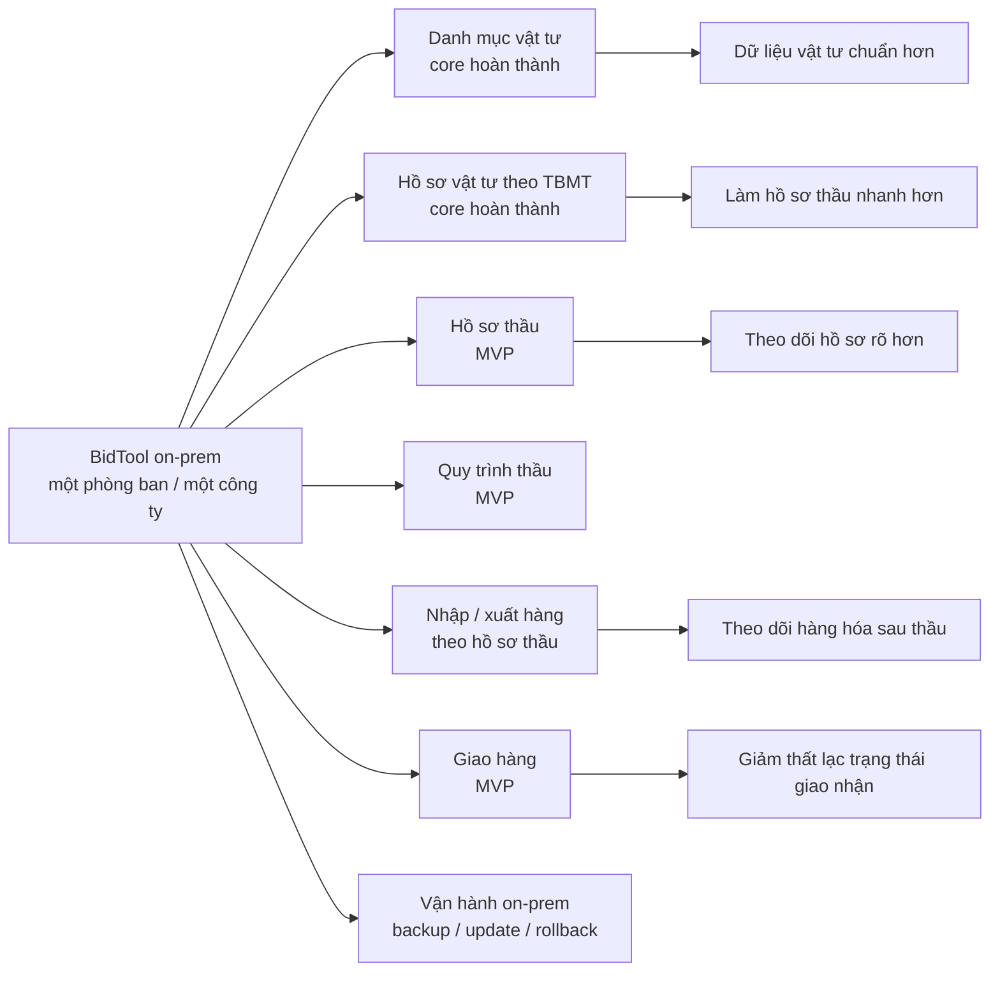
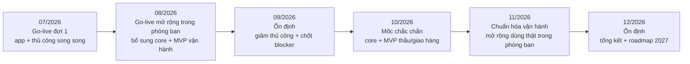
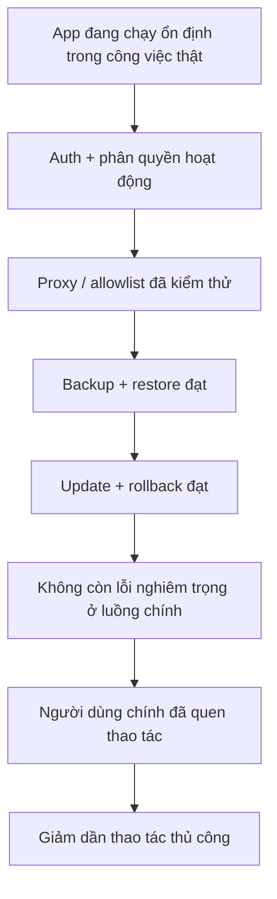

# Lộ trình triển khai BidTool on-prem cho một phòng ban

**Phiên bản:** Bản công ty xem  
**Ngày lập:** 02/07/2026  
**Giai đoạn chi tiết:** Tháng 07/2026 đến hết ngày 31/12/2026  
**Khung chương trình:** 3 năm  
**Phạm vi tổ chức:** Một phòng ban riêng biệt trong một công ty duy nhất  
**Đối tượng đọc:** Ban giám đốc, trưởng phòng vật tư, trưởng phòng đấu thầu, đội vận hành nội bộ

## 1. Mục tiêu

BidTool được triển khai theo mô hình **on-prem cho một phòng ban riêng biệt trong một công ty duy nhất**, chạy trong hạ tầng nội bộ của khách hàng. Trong 3 năm, phạm vi mặc định chỉ phục vụ phòng ban đã chốt và không mở rộng sang công ty khác.

Thực tế triển khai bắt đầu **go-live trong tháng 07-08/2026** theo mô hình song song: đội nghiệp vụ vừa dùng app, vừa duy trì file/quy trình thủ công để không gián đoạn hồ sơ thầu.

Mục tiêu chắc chắn đến hết **tháng 10/2026**:

- Hoàn thành core **Danh mục vật tư**.
- Hoàn thành core **Hồ sơ vật tư theo Số TBMT**.
- Hoàn thành MVP **quản lý hồ sơ thầu**.
- Hoàn thành MVP **quản lý quy trình thầu**.
- Hoàn thành MVP **quản lý nhập/xuất hàng theo hồ sơ thầu**.
- Hoàn thành MVP **quản lý giao hàng** và các nghiệp vụ liên quan.

Mục tiêu đến hết ngày **31/12/2026** là ổn định vận hành trong phòng ban này, giảm dần phần thủ công, chuẩn hóa SOP và lập kế hoạch năm 2027.

## 2. Kết quả kỳ vọng cuối năm 2026

| Nhóm việc                | Kết quả cần đạt                                                                                                          |
| ------------------------ | ------------------------------------------------------------------------------------------------------------------------ |
| Danh mục vật tư          | Có thể nhập, tìm kiếm, chỉnh sửa, chuẩn hóa và dùng làm nguồn dữ liệu chung cho đội vật tư/đấu thầu.                     |
| Hồ sơ vật tư             | Có thể tạo work theo Số TBMT, upload BOQ, map sheet, duyệt vật tư, export file kết quả.                                  |
| Hồ sơ thầu               | Có MVP để quản lý trạng thái, tài liệu, người phụ trách, deadline và việc cần làm theo từng hồ sơ thầu.                  |
| Quy trình thầu           | Có MVP để theo dõi các bước chính từ tiếp nhận, chuẩn bị hồ sơ, duyệt, nộp, theo dõi kết quả đến xử lý sau thầu.         |
| Nhập/xuất hàng           | Có MVP để ghi nhận nhập, xuất, trả và điều chỉnh hàng hóa gắn với hồ sơ thầu hoặc công trình liên quan.                  |
| Giao hàng                | Có MVP để theo dõi kế hoạch giao, trạng thái giao, bằng chứng giao/nhận và các việc phát sinh liên quan.                 |
| On-prem                  | Cài được trên server nội bộ, có backup/restore, update/rollback, hoạt động trong môi trường mạng có proxy.               |
| Phạm vi tổ chức          | Dùng cho một phòng ban riêng biệt trong một công ty duy nhất; không phải nền tảng SaaS hay triển khai đa công ty.        |
| Người dùng               | Có tài khoản, vai trò và quyền truy cập rõ ràng cho admin, manager và staff.                                             |
| Vận hành song song 07-08 | Người dùng làm hồ sơ thầu trên app nhưng vẫn duy trì file/quy trình thủ công làm phương án dự phòng trong giai đoạn đầu. |
| Đào tạo và chuyển giao   | Có tài liệu hướng dẫn, buổi chuyển giao và checklist thao tác cho người dùng chính.                                      |

Sơ đồ kết quả:

## 3. Phạm vi triển khai

### Trong phạm vi năm 2026

- Triển khai BidTool trên server nội bộ cho một phòng ban riêng biệt trong một công ty duy nhất.
- Go-live thực tế trong tháng 07-08 theo mô hình app + thủ công song song.
- Cấu hình truy cập qua mạng LAN hoặc domain nội bộ.
- Hỗ trợ môi trường mạng có **restricted proxy**.
- Bật đăng nhập và phân quyền.
- Hoàn thiện workflow Danh mục vật tư.
- Hoàn thiện workflow Hồ sơ vật tư theo TBMT.
- Xây dựng MVP quản lý hồ sơ thầu.
- Xây dựng MVP quản lý quy trình thầu.
- Xây dựng MVP quản lý nhập/xuất hàng theo hồ sơ thầu.
- Xây dựng MVP quản lý giao hàng và nghiệp vụ liên quan.
- Tổ chức UAT, đào tạo, hỗ trợ trong giai đoạn chạy thật và chuyển dần khỏi thao tác thủ công.

### Ngoài phạm vi tổ chức

- Không triển khai cho công ty thứ hai.
- Không triển khai SaaS hoặc multi-tenant thương mại.
- Không mặc định mở rộng sang phòng ban khác trong cùng công ty nếu chưa có phụ lục riêng.
- Không biến roadmap 2026 thành rollout toàn công ty.

## 4. Lộ trình theo tháng

### Tháng 07/2026: Go-live thực tế đợt 1

Mục tiêu tháng 7 là đưa hệ thống vào sử dụng thật ở phạm vi kiểm soát, đồng thời vẫn giữ cách làm thủ công cho hồ sơ thầu để đảm bảo không gián đoạn vận hành.

Kết quả cần có:

- Người dùng chính bắt đầu làm hồ sơ thầu trên app.
- File/quy trình thủ công vẫn được duy trì làm phương án dự phòng.
- Ghi nhận lỗi, thao tác thiếu và điểm nghẽn từ công việc thật.
- Chốt lại yêu cầu chi tiết cho quản lý hồ sơ thầu, quy trình thầu, nhập/xuất hàng và giao hàng.
- Hoàn thiện cấu hình on-prem, proxy, tài khoản và quyền truy cập cần thiết.

### Tháng 08/2026: Go-live mở rộng trong phòng ban và xây phần thiếu

Mục tiêu tháng 8 là mở rộng sử dụng thật trong phòng ban đã chốt, vừa vận hành vừa hoàn thiện các phần còn thiếu trong core và MVP vận hành sau thầu.

Kết quả cần có:

- Danh mục vật tư ổn định hơn với import Excel/CSV, tìm kiếm, lọc, chỉnh sửa và nguồn giá.
- Hồ sơ vật tư chạy được đầy đủ các bước chính: upload, map, duyệt, preview/export.
- Có màn hình và dữ liệu nền cho hồ sơ thầu, quy trình thầu, nhập/xuất hàng và giao hàng.
- Auth/RBAC chạy trên môi trường on-prem đang dùng.
- Có danh sách thao tác nào còn phải làm thủ công và kế hoạch thay thế dần bằng app.

### Tháng 09/2026: Ổn định, giảm thủ công và chốt blocker

Mục tiêu tháng 9 là giảm dần phụ thuộc vào file/quy trình thủ công, kiểm thử các luồng vận hành chính bằng dữ liệu thật và chốt danh sách blocker trước mốc tháng 10.

Kết quả cần có:

- Chạy UAT cho Danh mục vật tư, Hồ sơ vật tư, hồ sơ thầu, quy trình thầu, nhập/xuất hàng và giao hàng.
- Chạy thử backup, restore, update và rollback.
- Chạy thử restricted proxy cho BidWinner, tìm kiếm web, AI nếu bật, và cập nhật phiên bản.
- Có luồng MVP đầy đủ cho nhập hàng, xuất hàng, trả/điều chỉnh hàng và giao hàng theo hồ sơ thầu.
- Có danh sách lỗi và blocker phải xử lý trước cuối tháng 10.
- Xác định rõ thao tác nào vẫn cần giữ thủ công sau tháng 10 nếu chưa đủ an toàn để bỏ.

### Tháng 10/2026: Hoàn tất core và MVP vận hành theo hồ sơ thầu

Mục tiêu tháng 10 là mốc hoàn thành chắc chắn cho core và các MVP vận hành chính quanh hồ sơ thầu.

Kết quả cần có:

- Danh mục vật tư sẵn sàng production.
- Hồ sơ vật tư theo TBMT sẵn sàng production.
- MVP quản lý hồ sơ thầu hoàn thành.
- MVP quản lý quy trình thầu hoàn thành.
- MVP quản lý nhập/xuất hàng theo hồ sơ thầu hoàn thành.
- MVP quản lý giao hàng và các nghiệp vụ liên quan hoàn thành.
- Người dùng chính được đào tạo.
- SOP vận hành app + phần thủ công còn giữ lại được cập nhật.
- Có kế hoạch chuyển các phần đủ ổn định từ thủ công sang app.

### Tháng 11/2026: Chuẩn hóa vận hành sau mốc tháng 10

Mục tiêu tháng 11 là chuẩn hóa cách dùng sau khi core và MVP đã hoàn thành, mở rộng mức độ dùng thật trong chính phòng ban đã chốt.

Kết quả cần có:

- Danh mục vật tư và Hồ sơ vật tư được dùng ổn định trong công việc thật.
- Có log hỗ trợ và xử lý lỗi hàng tuần.
- Hồ sơ thầu, quy trình thầu, nhập/xuất hàng và giao hàng được dùng với dữ liệu thật ở phạm vi đã thống nhất.
- Có báo cáo trạng thái hồ sơ thầu, việc cần làm, hàng đã nhập/xuất và trạng thái giao hàng.
- Hoàn thiện SOP vận hành.

### Tháng 12/2026: Ổn định và tổng kết

Mục tiêu tháng 12 là ổn định hệ thống, tổng kết hiệu quả và lên kế hoạch quý 1/2027.

Kết quả cần có:

- Báo cáo ổn định production.
- Báo cáo kết quả dùng thật các MVP: hồ sơ thầu, quy trình thầu, nhập/xuất hàng và giao hàng.
- Danh sách cải tiến cho năm 2027.
- Bản vá cuối năm nếu cần.
- Diễn tập backup/restore.
- Kế hoạch cải tiến quản lý hàng hóa/giao hàng sau MVP trong cùng phòng ban.

## 5. Mục tiêu 3 tháng đầu

| Tháng   | Mục tiêu             | Tiêu chí hoàn thành                                                                                                    |
| ------- | -------------------- | ---------------------------------------------------------------------------------------------------------------------- |
| 07/2026 | Go-live đợt 1        | Người dùng làm hồ sơ thầu trên app trong phạm vi kiểm soát, vẫn giữ thủ công song song và có log lỗi/thiếu sót.        |
| 08/2026 | Go-live mở rộng      | Core vật tư/hồ sơ vật tư dùng được trong phòng ban; nền tảng hồ sơ thầu, quy trình thầu, nhập/xuất và giao hàng đã có. |
| 09/2026 | Ổn định trước mốc 10 | UAT bằng dữ liệu thật, backup/restore/update/rollback đạt, danh sách blocker tháng 10 được chốt.                       |

## 6. Vai trò người dùng

| Vai trò | Mô tả                                                                                                         |
| ------- | ------------------------------------------------------------------------------------------------------------- |
| Admin   | Toàn quyền hệ thống, cấu hình, người dùng, cập nhật và vận hành on-prem.                                      |
| Manager | Quản trị người dùng và cấu hình, không trực tiếp làm nghiệp vụ vật tư/kho.                                    |
| Staff   | Thực hiện nghiệp vụ hằng ngày: vật tư, hồ sơ vật tư, scrape, enrich, hồ sơ thầu, nhập/xuất hàng và giao hàng. |

## 7. Điều kiện chuyển từ song song sang ưu tiên dùng app

Vì go-live thực tế đã bắt đầu trong tháng 07-08, điều kiện dưới đây dùng để quyết định phần nào có thể giảm thao tác thủ công và ưu tiên dùng app:

- App đang được sử dụng trong công việc thật và không làm chậm quy trình chính.
- Đăng nhập và phân quyền hoạt động đúng.
- Proxy/allowlist đã được xác nhận.
- Backup và restore đã chạy thử thành công.
- Update và rollback đã chạy thử thành công.
- UAT/dùng thật không còn lỗi nghiêm trọng ở luồng chính.
- Người dùng chính đã được đào tạo.
- Có đầu mối hỗ trợ nghiệp vụ và kỹ thuật.

## 8. Rủi ro chính

| Rủi ro                                                  | Ảnh hưởng                                      | Cách xử lý                                                          |
| ------------------------------------------------------- | ---------------------------------------------- | ------------------------------------------------------------------- |
| Proxy chặn BidWinner, supplier site hoặc GitHub release | Tìm kiếm, scrape hoặc update có thể không chạy | Chốt allowlist sớm và kiểm thử smoke test trong tháng 9.            |
| Dữ liệu vật tư không sạch                               | Match sai, export kém chất lượng               | Chạy đợt chuẩn hóa dữ liệu trước mốc tháng 10.                      |
| Người dùng chưa quen workflow mới                       | Phải giữ thủ công song song lâu hơn            | Đào tạo bằng dữ liệu thật và có SOP ngắn.                           |
| MVP sau thầu bị mở rộng quá nhanh                       | Trễ core vật tư/hồ sơ vật tư                   | Giữ mốc tháng 10 cho MVP, phần nâng cao đưa sang 2027.              |
| Migration/rollback dữ liệu không đủ chắc                | Rủi ro khi cập nhật on-prem                    | Kiểm thử backup/restore và ưu tiên hotfix tiến thay vì rollback DB. |

## 9. Kết luận

Lộ trình năm 2026 tập trung vào việc vận hành thật sớm từ tháng 07-08, vừa dùng app vừa giữ thủ công song song để bảo toàn tiến độ hồ sơ thầu. Đến tháng 10, **Danh mục vật tư** và **Hồ sơ vật tư theo TBMT** phải hoàn thành core, đồng thời hoàn thành MVP cho **hồ sơ thầu**, **quy trình thầu**, **nhập/xuất hàng theo hồ sơ thầu** và **giao hàng**.
