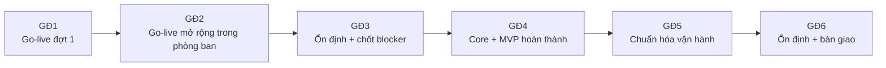
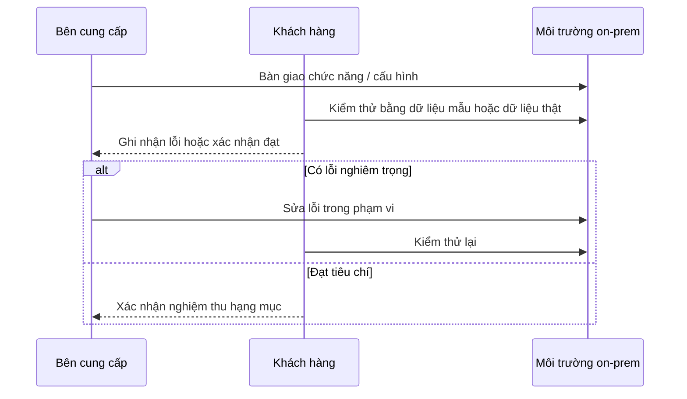
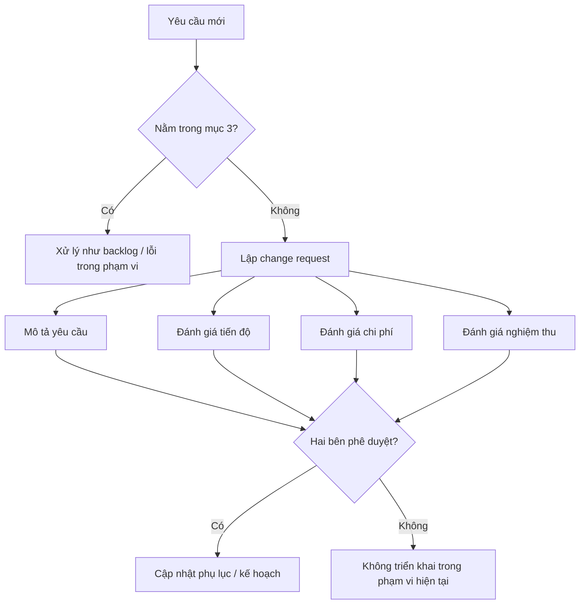

# Phụ lục phạm vi công việc: BidTool on-prem 2026

**Phiên bản:** Bản tham khảo đưa vào hợp đồng  
**Ngày lập:** 02/07/2026  
**Thời gian chi tiết:** Từ tháng 07/2026 đến hết ngày 31/12/2026  
**Khung chương trình:** 3 năm  
**Mô hình triển khai:** On-prem cho một phòng ban riêng biệt trong một công ty duy nhất  
**Ghi chú:** Tài liệu này là bản phạm vi kỹ thuật/thương mại để rà soát hợp đồng, không thay thế tư vấn pháp lý.

## 1. Phạm vi dịch vụ

Bên cung cấp thực hiện triển khai hệ thống BidTool trên hạ tầng nội bộ của khách hàng, phục vụ **một phòng ban riêng biệt trong một công ty duy nhất**. Phạm vi này không bao gồm triển khai cho công ty khác, không bao gồm SaaS/multi-company, và không tự động mở rộng sang phòng ban khác nếu không có phụ lục riêng.

Các nhóm nghiệp vụ trong phạm vi:

- Danh mục vật tư.
- Hồ sơ vật tư theo Số TBMT.
- Quản lý hồ sơ thầu.
- Quản lý quy trình thầu.
- Quản lý nhập/xuất hàng theo hồ sơ thầu.
- Quản lý giao hàng và các nghiệp vụ liên quan.
- Quản trị người dùng và phân quyền.
- Vận hành on-prem: cài đặt, cập nhật, sao lưu, khôi phục và rollback ứng dụng.

Hai bên ghi nhận rằng hệ thống **go-live thực tế trong tháng 07-08/2026** theo mô hình song song: người dùng làm nghiệp vụ trên app, đồng thời duy trì file/quy trình thủ công để đối chiếu và dự phòng. Mốc cuối tháng **10/2026** là mốc hoàn thành core và MVP nêu trong phạm vi này.

### Khung chương trình 3 năm

| Năm               | Phạm vi định hướng                                                                  | Ranh giới                                                             |
| ----------------- | ----------------------------------------------------------------------------------- | --------------------------------------------------------------------- |
| Năm 1: 07-12/2026 | Go-live thật, hoàn thành core và MVP theo hồ sơ thầu.                               | Một phòng ban riêng biệt, app + thủ công song song ở giai đoạn đầu.   |
| Năm 2: 2027       | Ổn định, giảm thủ công, nâng báo cáo, chuẩn hóa dữ liệu và quy trình.               | Vẫn trong cùng công ty và cùng phòng ban nếu chưa có phụ lục mở rộng. |
| Năm 3: 2028       | Tối ưu, tự động hóa có kiểm soát, chuẩn bị tích hợp hoặc mở rộng chiều sâu nếu cần. | Không triển khai cho công ty khác trong chương trình này.             |

## 2. Thời gian và giai đoạn thực hiện

| Giai đoạn   | Thời gian mục tiêu | Nội dung                                                                                            |
| ----------- | ------------------ | --------------------------------------------------------------------------------------------------- |
| Giai đoạn 1 | 07/2026            | Go-live đợt 1, dùng app trong phạm vi kiểm soát, duy trì thủ công song song.                        |
| Giai đoạn 2 | 08/2026            | Go-live mở rộng trong phòng ban, hoàn thiện core vật tư/hồ sơ vật tư và dựng nền tảng MVP sau thầu. |
| Giai đoạn 3 | 09/2026            | Ổn định, UAT bằng dữ liệu thật, kiểm thử on-prem, chốt blocker trước mốc tháng 10.                  |
| Giai đoạn 4 | 10/2026            | Hoàn thành core Danh mục vật tư, Hồ sơ vật tư và MVP hồ sơ thầu/quy trình thầu/nhập-xuất/giao hàng. |
| Giai đoạn 5 | 11/2026            | Chuẩn hóa vận hành trong phòng ban, tăng mức dùng thật, giảm dần thao tác thủ công.                 |
| Giai đoạn 6 | 12/2026            | Ổn định, tổng kết, bàn giao tài liệu và kế hoạch tiếp theo.                                         |

Mốc thời gian có thể được điều chỉnh khi có thay đổi phạm vi, chậm trễ từ hạ tầng, dữ liệu mẫu, UAT hoặc quyết định nghiệp vụ từ khách hàng.

Sơ đồ giai đoạn bàn giao:

## 3. Hạng mục bàn giao

### 3.1. Hạ tầng on-prem

Bàn giao:

- Bộ cấu hình chạy ứng dụng on-prem bằng Docker.
- Cấu hình reverse proxy nội bộ.
- Cấu hình PostgreSQL.
- Cấu hình SearXNG nếu khách hàng sử dụng web evidence/search nội bộ.
- Tài liệu biến môi trường.
- Tài liệu cài đặt, cập nhật, sao lưu, khôi phục.
- Kiểm thử healthcheck sau cài đặt.

Điều kiện:

- Khách hàng cung cấp server, hệ điều hành, quyền cài đặt và chính sách mạng phù hợp.
- Nếu hạ tầng dùng restricted proxy, khách hàng cung cấp thông tin proxy và allowlist cần thiết.
- Hạ tầng phục vụ phòng ban triển khai đã chốt; môi trường cho phòng ban/công ty khác không thuộc phạm vi mặc định.

### 3.2. Xác thực và phân quyền

Bàn giao:

- Bật cơ chế đăng nhập.
- Tạo tài khoản admin đầu tiên.
- Cấu hình vai trò:
  - `admin`
  - `manager`
  - `staff`
- Hướng dẫn tạo, khóa, mở khóa và phân quyền người dùng.

Giới hạn:

- Không bao gồm SSO/LDAP/OIDC nếu không có phụ lục riêng.

### 3.3. Danh mục vật tư

Bàn giao:

- Nhập danh mục từ Excel/CSV.
- Xem danh sách vật tư.
- Tìm kiếm và lọc vật tư.
- Thêm, sửa, xóa vật tư theo quyền.
- Quản lý nguồn giá.
- Scrape shop ở mức các website được hỗ trợ và không bị chặn bởi hạ tầng.
- Enrich dữ liệu vật tư theo khả năng cấu hình tìm kiếm/AI.

Tiêu chí nghiệm thu:

- Người dùng có thể import file mẫu.
- Dữ liệu hợp lệ được lưu vào danh mục.
- Người dùng có thể tìm, lọc và chỉnh sửa vật tư.
- Dữ liệu vật tư có thể dùng cho workflow Hồ sơ vật tư.

### 3.4. Hồ sơ vật tư theo Số TBMT

Bàn giao:

- Tạo work theo Số TBMT.
- Upload file BOQ Excel.
- Chọn sheet vật tư và header row.
- Map cột vật tư.
- Chạy match với danh mục vật tư.
- Duyệt candidate.
- Bulk apply và undo nếu phù hợp.
- Preview file export.
- Export folder kết quả.
- Resume work đã tạo.

Tiêu chí nghiệm thu:

- Người dùng tạo được hồ sơ từ Số TBMT.
- Người dùng upload và map được BOQ mẫu.
- Hệ thống tạo danh sách vật tư cần duyệt.
- Người dùng duyệt được match.
- Hệ thống export được file kết quả có cột bổ sung.

### 3.5. Quản lý hồ sơ thầu MVP

Bàn giao MVP:

- Tạo và cập nhật hồ sơ thầu.
- Lưu thông tin chính: mã hồ sơ/Số TBMT, tên gói, chủ đầu tư/bên mời thầu, deadline, trạng thái, người phụ trách.
- Gắn tài liệu hoặc đường dẫn tài liệu liên quan.
- Theo dõi việc cần làm và ghi chú xử lý.
- Danh sách hồ sơ theo trạng thái.

Tiêu chí nghiệm thu MVP:

- Tạo được một hồ sơ thầu mẫu.
- Cập nhật được trạng thái và người phụ trách.
- Xem được danh sách hồ sơ theo trạng thái.
- Gắn được tài liệu hoặc đường dẫn tài liệu.

### 3.6. Quản lý quy trình thầu MVP

Bàn giao MVP:

- Theo dõi các bước chính của quy trình thầu.
- Gán người phụ trách từng bước.
- Ghi nhận deadline, trạng thái và ghi chú.
- Xem việc đang chờ xử lý.

Tiêu chí nghiệm thu MVP:

- Một hồ sơ thầu đi được qua các bước chính đã thống nhất.
- Người dùng cập nhật được trạng thái từng bước.
- Có danh sách việc đang chờ xử lý theo người phụ trách hoặc hồ sơ.

### 3.7. Quản lý nhập/xuất hàng theo hồ sơ thầu MVP

Bàn giao MVP:

- Phiếu nhập hàng gắn với hồ sơ thầu hoặc công trình liên quan.
- Phiếu xuất hàng gắn với hồ sơ thầu hoặc công trình liên quan.
- Phiếu trả/điều chỉnh hàng ở mức cơ bản.
- Danh sách lịch sử nhập/xuất/trả/điều chỉnh.
- Số lượng hàng hóa theo hồ sơ thầu hoặc địa điểm liên quan.

Tiêu chí nghiệm thu MVP:

- Nhập được hàng theo hồ sơ thầu mẫu.
- Xuất được hàng theo hồ sơ thầu mẫu.
- Ghi nhận được trả hoặc điều chỉnh số lượng có lý do.
- Xem được lịch sử nhập/xuất/trả/điều chỉnh.

### 3.8. Quản lý giao hàng MVP

Bàn giao MVP:

- Tạo kế hoạch giao hàng theo hồ sơ thầu hoặc công trình liên quan.
- Cập nhật trạng thái giao hàng.
- Ghi nhận người nhận, ngày giao dự kiến, ngày giao thực tế.
- Gắn ghi chú hoặc bằng chứng giao/nhận ở mức cơ bản.
- Danh sách giao hàng theo trạng thái.

Tiêu chí nghiệm thu MVP:

- Tạo được kế hoạch giao hàng mẫu.
- Cập nhật được trạng thái giao hàng.
- Ghi nhận được ngày giao, người nhận và ghi chú giao/nhận.
- Xem được danh sách giao hàng theo trạng thái.

## 4. Tiêu chí nghiệm thu chung

Một hạng mục được xem là nghiệm thu khi:

- Chức năng chạy được trên môi trường on-prem hoặc staging on-prem đã thống nhất.
- Có dữ liệu mẫu hoặc dữ liệu thật để kiểm thử.
- Không còn lỗi nghiêm trọng làm chặn quy trình chính.
- Có hướng dẫn sử dụng hoặc hướng dẫn vận hành tương ứng.
- Đại diện khách hàng xác nhận kết quả kiểm thử.

## 5. Trách nhiệm bên cung cấp

Bên cung cấp chịu trách nhiệm:

- Phân tích và ghi nhận yêu cầu trong phạm vi đã thống nhất.
- Phát triển, cấu hình và bàn giao các chức năng nêu tại mục 3.
- Hỗ trợ cài đặt on-prem theo điều kiện hạ tầng đã thống nhất.
- Hỗ trợ vận hành song song app + thủ công trong giai đoạn tháng 07-08.
- Cung cấp tài liệu vận hành cơ bản.
- Hỗ trợ UAT theo lịch hai bên thống nhất.
- Hỗ trợ đào tạo người dùng chính.
- Sửa lỗi phát sinh trong phạm vi nghiệm thu.

## 6. Trách nhiệm khách hàng

Khách hàng chịu trách nhiệm:

- Cung cấp server, hệ điều hành, tài nguyên máy và quyền truy cập cần thiết.
- Cung cấp chính sách mạng, proxy, allowlist và đầu mối kỹ thuật.
- Cung cấp dữ liệu mẫu đúng thời hạn.
- Cung cấp danh sách người dùng thuộc phòng ban triển khai.
- Cử người dùng tham gia workshop, UAT, dùng thử thực tế và đào tạo.
- Duy trì quy trình thủ công song song trong giai đoạn 07-08 để đối chiếu/dự phòng.
- Xác nhận nguồn dữ liệu đúng khi app và file thủ công có sai lệch.
- Xác nhận quyết định nghiệp vụ đúng thời hạn.
- Chịu trách nhiệm với tính đúng, đủ và hợp pháp của dữ liệu đầu vào.
- Quản lý tài khoản, phân quyền nội bộ và việc sử dụng hệ thống sau bàn giao.

## 7. Điều kiện hạ tầng on-prem

Hạ tầng tối thiểu cần thống nhất trước khi cài đặt:

- Server hoặc máy ảo chạy được Docker Engine và Docker Compose.
- Tài nguyên phù hợp cho PostgreSQL, ứng dụng và tác vụ scrape/enrich.
- Dung lượng lưu trữ cho database, file export, backup và log.
- Port truy cập nội bộ cho HTTP/HTTPS.
- Domain nội bộ hoặc địa chỉ IP truy cập.
- Cấu hình proxy nếu có.
- Danh sách domain được phép truy cập cho:
  - BidWinner,
  - supplier websites,
  - SearXNG hoặc search provider,
  - AI provider nếu bật,
  - GitHub Releases/GHCR hoặc nguồn update offline.

## 8. Cập nhật, backup và rollback

Bàn giao vận hành gồm:

- Lệnh hoặc quy trình cập nhật phiên bản.
- Cơ chế tạo backup trước khi update.
- Quy trình restore từ backup.
- Quy trình rollback app artifact khi phù hợp.
- Lưu ý database migration là tiến về trước; trong một số trường hợp, phương án xử lý ưu tiên là phát hành hotfix thay vì rollback database.

Khách hàng chịu trách nhiệm lưu trữ backup dài hạn và chính sách bảo mật backup nếu không có thỏa thuận hỗ trợ vận hành riêng.

## 9. Quản lý thay đổi phạm vi

Các yêu cầu ngoài phạm vi tại mục 3 sẽ được xử lý theo quy trình change request.

Một change request có thể bao gồm:

- Mô tả yêu cầu mới.
- Ảnh hưởng đến tiến độ.
- Ảnh hưởng đến chi phí.
- Ảnh hưởng đến nghiệm thu.
- Thời điểm bàn giao mới nếu được hai bên chấp thuận.

## 10. Hạng mục loại trừ

Trừ khi có phụ lục riêng, phạm vi này không bao gồm:

- Triển khai cho công ty khác.
- Triển khai SaaS hoặc multi-company.
- Mở rộng sang phòng ban khác trong cùng công ty.
- SSO/LDAP/OIDC.
- Tích hợp ERP/kế toán.
- Mobile app.
- Barcode/QR scanning.
- High availability hoặc disaster recovery nhiều server.
- Tùy biến báo cáo không được nêu trong phạm vi.
- Làm sạch dữ liệu vật tư toàn diện thay khách hàng.
- Nhập dữ liệu lịch sử từ nguồn không chuẩn.
- Cam kết scrape thành công mọi website.
- Cam kết AI/web research hoạt động khi mạng khách hàng chặn dịch vụ ngoài.
- Tự động hóa toàn bộ quy trình thầu, nhập/xuất hoặc giao hàng không cần người phụ trách.
- Rollout toàn công ty ngoài phòng ban đã chốt.
- Vận hành hệ thống 24/7.
- Hỗ trợ ngoài giờ nếu không có thỏa thuận riêng.

## 11. Bàn giao tài liệu và đào tạo

Bàn giao tối thiểu:

- Hướng dẫn cài đặt/vận hành on-prem.
- Hướng dẫn backup/restore/update/rollback.
- Hướng dẫn quản lý người dùng.
- Hướng dẫn Danh mục vật tư.
- Hướng dẫn Hồ sơ vật tư.
- Hướng dẫn quản lý hồ sơ thầu.
- Hướng dẫn quản lý quy trình thầu.
- Hướng dẫn nhập/xuất hàng theo hồ sơ thầu.
- Hướng dẫn quản lý giao hàng.
- Checklist UAT.

Đào tạo tối thiểu:

- Một buổi cho admin/IT nội bộ.
- Một buổi cho người dùng nghiệp vụ vật tư/hồ sơ vật tư.
- Một buổi cho người dùng nghiệp vụ hồ sơ thầu/quy trình thầu.
- Một buổi cho người dùng nghiệp vụ nhập/xuất hàng và giao hàng.

## 12. Hỗ trợ vận hành

Trong giai đoạn tháng 07/2026 đến tháng 12/2026, bên cung cấp hỗ trợ:

- Ghi nhận lỗi từ vận hành thật.
- Phân loại mức độ ưu tiên.
- Sửa lỗi trong phạm vi đã nghiệm thu.
- Hướng dẫn vận hành khi có sự cố thông thường.
- Hỗ trợ đối chiếu app với quy trình thủ công trong giai đoạn song song.
- Tổng kết các vấn đề cần đưa vào roadmap Q1/2027.

Các yêu cầu phát triển mới hoặc mở rộng ngoài phạm vi được xử lý theo change request.
