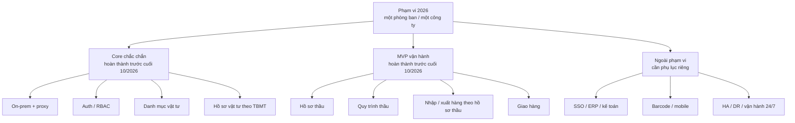
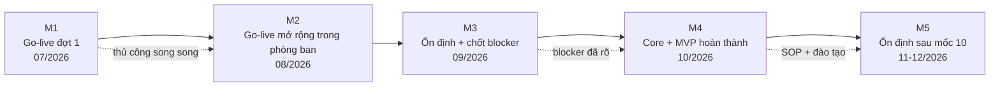
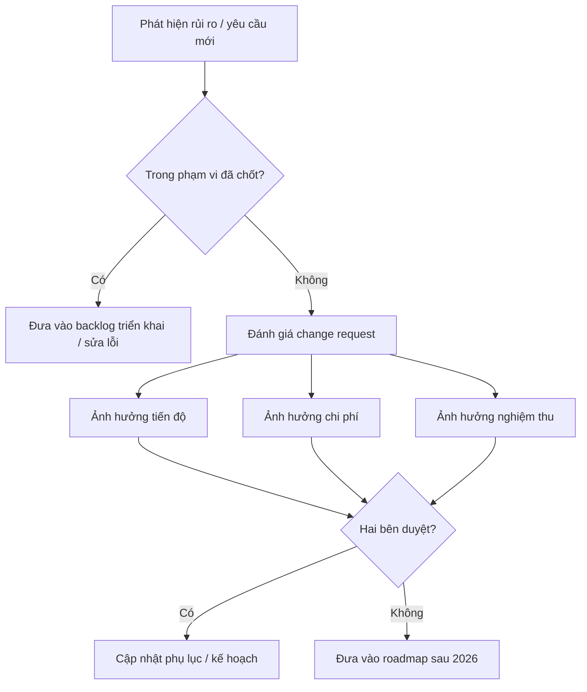

# Lộ trình BidTool on-prem 2026

**Phiên bản:** Bản dùng trong đàm phán  
**Ngày lập:** 02/07/2026  
**Giai đoạn chi tiết:** Tháng 07/2026 đến hết ngày 31/12/2026  
**Khung chương trình:** 3 năm  
**Phạm vi tổ chức:** Một phòng ban riêng biệt trong một công ty duy nhất  
**Mục đích:** Làm rõ phạm vi, mốc triển khai, phụ thuộc và ranh giới cam kết khi thương lượng triển khai on-prem

## 1. Mục tiêu hợp tác

Hai bên phối hợp triển khai BidTool theo mô hình **on-prem cho một phòng ban riêng biệt trong một công ty duy nhất**. Đây là chương trình 3 năm, nhưng phạm vi mặc định không bao gồm triển khai cho công ty khác, không phải SaaS, và không tự động mở rộng sang phòng ban khác nếu chưa có phụ lục riêng.

Điểm cần thống nhất ngay từ đầu: hệ thống **go-live thực tế trong tháng 07-08/2026**, nhưng hồ sơ thầu vẫn được xử lý song song bằng app và phương pháp thủ công để giảm rủi ro vận hành.

Mốc cam kết quan trọng nhất là **cuối tháng 10/2026**:

- Core Danh mục vật tư hoàn thành.
- Core Hồ sơ vật tư theo Số TBMT hoàn thành.
- MVP quản lý hồ sơ thầu hoàn thành.
- MVP quản lý quy trình thầu hoàn thành.
- MVP quản lý nhập/xuất hàng theo hồ sơ thầu hoàn thành.
- MVP quản lý giao hàng và các nghiệp vụ liên quan hoàn thành.

Giai đoạn tháng 11-12/2026 tập trung vào chuẩn hóa vận hành trong phòng ban đã chốt, giảm dần thao tác thủ công và lập roadmap năm 2027.

### Khung 3 năm để thương lượng

| Năm               | Nội dung thương lượng chính                                                         | Ranh giới                                                             |
| ----------------- | ----------------------------------------------------------------------------------- | --------------------------------------------------------------------- |
| Năm 1: 07-12/2026 | Go-live thật, hoàn thành core và MVP theo hồ sơ thầu.                               | Một phòng ban riêng biệt, app + thủ công song song ở giai đoạn đầu.   |
| Năm 2: 2027       | Ổn định, giảm thủ công, nâng báo cáo, chuẩn hóa dữ liệu và quy trình.               | Vẫn trong cùng công ty và cùng phòng ban nếu chưa có phụ lục mở rộng. |
| Năm 3: 2028       | Tối ưu, tự động hóa có kiểm soát, chuẩn bị tích hợp hoặc mở rộng chiều sâu nếu cần. | Không triển khai cho công ty khác trong chương trình này.             |

## 2. Cấu phần triển khai

### 2.1. Gói cốt lõi cần cam kết

| Cấu phần                 | Nội dung                                                                                         |
| ------------------------ | ------------------------------------------------------------------------------------------------ |
| On-prem deployment       | Cài đặt BidTool trên server nội bộ, chạy qua Docker, Caddy, PostgreSQL và cấu hình môi trường.   |
| Phạm vi tổ chức          | Một phòng ban riêng biệt trong một công ty duy nhất; không phải triển khai đa công ty.           |
| Restricted proxy         | Hỗ trợ cấu hình proxy và danh sách domain cần allowlist.                                         |
| Auth/RBAC                | Bật đăng nhập, tài khoản admin đầu tiên, vai trò admin/manager/staff.                            |
| Danh mục vật tư          | Import Excel/CSV, tìm kiếm, lọc, chỉnh sửa, nguồn giá, dữ liệu chuẩn hóa.                        |
| Hồ sơ vật tư             | Tạo work theo Số TBMT, upload BOQ, map sheet, duyệt match, preview/export.                       |
| Hồ sơ thầu               | Quản lý thông tin, trạng thái, tài liệu, deadline, người phụ trách và việc cần làm.              |
| Quy trình thầu           | Theo dõi các bước chính từ tiếp nhận, chuẩn bị, duyệt, nộp, theo dõi kết quả và xử lý sau thầu.  |
| Nhập/xuất hàng theo thầu | Ghi nhận nhập, xuất, trả, điều chỉnh hàng hóa theo hồ sơ thầu hoặc công trình liên quan.         |
| Giao hàng                | Theo dõi kế hoạch giao, trạng thái giao, bằng chứng giao/nhận và phát sinh liên quan.            |
| Release operations       | Backup, restore, update, rollback, version check.                                                |
| Vận hành song song 07-08 | App được dùng trong công việc thật nhưng thủ công vẫn là phương án dự phòng trong giai đoạn đầu. |
| UAT và đào tạo           | Chạy nghiệm thu với dữ liệu khách hàng và đào tạo người dùng chính.                              |

### 2.2. Phần MVP và phần nâng cao

Các phần sau được chốt là **MVP đến tháng 10/2026**, không phải bản đầy đủ tất cả nghiệp vụ nâng cao:

- Quản lý hồ sơ thầu.
- Quản lý quy trình thầu.
- Quản lý nhập/xuất hàng theo hồ sơ thầu.
- Quản lý giao hàng.
- Báo cáo trạng thái cơ bản.

Không cam kết trong MVP 2026 nếu không có phụ lục riêng:

- Barcode/mobile scanning.
- Kệ, ô, vị trí chi tiết trong kho.
- Tích hợp ERP/kế toán.
- Tính giá vốn nâng cao.
- Báo cáo tài chính/kế toán.
- Quy trình phê duyệt nhiều cấp.
- Tự động hóa toàn bộ quy trình thầu không cần người duyệt.

Sơ đồ ranh giới phạm vi khi đàm phán:

## 3. Timeline thương lượng

| Thời gian | Mốc                             | Nội dung bàn giao chính                                                                                      |
| --------- | ------------------------------- | ------------------------------------------------------------------------------------------------------------ |
| 07/2026   | Go-live đợt 1                   | Dùng app trong phạm vi kiểm soát, hồ sơ thầu vẫn làm song song thủ công, ghi nhận lỗi và thiếu sót.          |
| 08/2026   | Go-live mở rộng trong phòng ban | Mở rộng sử dụng thật trong phòng ban, hoàn thiện core vật tư/hồ sơ vật tư và dựng nền tảng các MVP sau thầu. |
| 09/2026   | Ổn định trước mốc tháng 10      | UAT bằng dữ liệu thật, backup/restore/update/rollback, proxy smoke test, chốt blocker tháng 10.              |
| 10/2026   | Mốc hoàn thành chắc chắn        | Core vật tư/hồ sơ vật tư hoàn thành; MVP hồ sơ thầu, quy trình thầu, nhập/xuất hàng và giao hàng hoàn thành. |
| 11/2026   | Chuẩn hóa vận hành              | Tăng mức dùng thật trong phòng ban, giảm thao tác thủ công, hoàn thiện SOP và báo cáo vận hành cơ bản.       |
| 12/2026   | Ổn định và tổng kết             | Báo cáo ổn định, tổng kết vận hành, roadmap Q1/2027.                                                         |

## 4. Mốc nghiệm thu đề xuất

### Milestone 1: Go-live đợt 1

Thời điểm mục tiêu: trong tháng 07/2026.

Điều kiện nghiệm thu:

- Hệ thống on-prem chạy được trong môi trường thật hoặc môi trường dùng thật có kiểm soát.
- Người dùng chính bắt đầu làm hồ sơ thầu trên app.
- Có quy trình thủ công song song để đối chiếu và dự phòng.
- Có log lỗi/thiếu sót phát sinh từ công việc thật.

### Milestone 2: Go-live mở rộng trong phòng ban

Thời điểm mục tiêu: cuối tháng 08/2026.

Điều kiện nghiệm thu:

- Danh mục vật tư import/tìm kiếm/chỉnh sửa được trong vận hành thật.
- Hồ sơ vật tư chạy đủ 4 bước chính.
- Auth hoạt động trên on-prem.
- Có màn hình/dữ liệu nền cho hồ sơ thầu, quy trình thầu, nhập/xuất hàng và giao hàng.
- Phạm vi dùng thật vẫn nằm trong phòng ban đã chốt.

### Milestone 3: Ổn định trước mốc tháng 10

Thời điểm mục tiêu: cuối tháng 09/2026.

Điều kiện nghiệm thu:

- UAT/dùng thật bằng dữ liệu khách hàng cho các luồng chính.
- Backup/restore thành công.
- Update/rollback thành công.
- Proxy smoke test đạt.
- Có danh sách blocker phải xử lý trước cuối tháng 10.
- Có danh sách phần nào tiếp tục thủ công sau tháng 10 nếu chưa đủ an toàn để thay thế.

### Milestone 4: Hoàn thành core và MVP

Thời điểm mục tiêu: cuối tháng 10/2026.

Điều kiện nghiệm thu:

- Danh mục vật tư production-ready.
- Hồ sơ vật tư production-ready.
- MVP quản lý hồ sơ thầu hoàn thành.
- MVP quản lý quy trình thầu hoàn thành.
- MVP quản lý nhập/xuất hàng theo hồ sơ thầu hoàn thành.
- MVP quản lý giao hàng hoàn thành.
- Người dùng chính được đào tạo.
- Có SOP vận hành app và SOP phần thủ công còn giữ lại.

### Milestone 5: Ổn định sau mốc tháng 10

Thời điểm mục tiêu: cuối tháng 12/2026.

Điều kiện nghiệm thu:

- Core đã vận hành với dữ liệu thật.
- Có báo cáo hỗ trợ và lỗi đã xử lý.
- Có báo cáo sử dụng các MVP sau thầu.
- Có roadmap Q1/2027.

## 5. Trách nhiệm phía khách hàng

Để đảm bảo tiến độ, khách hàng cần cung cấp:

- Server hoặc máy ảo on-prem đáp ứng cấu hình tối thiểu đã thống nhất.
- Quyền truy cập cần thiết để cài đặt Docker và cấu hình domain/port.
- Thông tin proxy, chính sách mạng và danh sách domain được phép truy cập.
- Đầu mối kỹ thuật phụ trách hạ tầng.
- Đầu mối nghiệp vụ phụ trách vật tư, đấu thầu, hồ sơ thầu, nhập/xuất hàng và giao hàng.
- Danh sách người dùng thuộc phòng ban triển khai.
- File Excel vật tư mẫu.
- File BOQ mẫu theo TBMT.
- Mẫu hồ sơ thầu, trạng thái quy trình thầu và biểu mẫu giao/nhận hàng nếu có.
- Người dùng tham gia UAT/dùng thật đúng lịch.
- Quyết định nhanh đối với các điểm nghiệp vụ chưa rõ.

## 6. Trách nhiệm phía triển khai

Bên triển khai chịu trách nhiệm:

- Cài đặt và cấu hình BidTool trên môi trường on-prem theo phạm vi đã thống nhất.
- Cấu hình auth, roles và các biến môi trường cần thiết.
- Hỗ trợ cấu hình proxy ở mức ứng dụng và tài liệu allowlist.
- Phát triển/hoàn thiện chức năng trong phạm vi.
- Hỗ trợ giai đoạn go-live thật trong tháng 07-08.
- Hướng dẫn backup, restore, update, rollback.
- Hỗ trợ UAT và đối chiếu app với quy trình thủ công.
- Đào tạo người dùng chính.
- Ghi nhận và xử lý lỗi trong phạm vi roadmap.

## 7. Điều kiện hạ tầng cần thống nhất sớm

| Nhóm     | Nội dung cần chốt                                                 |
| -------- | ----------------------------------------------------------------- |
| Server   | CPU, RAM, ổ đĩa, hệ điều hành, quyền cài Docker.                  |
| Mạng     | LAN/domain nội bộ, port HTTP/HTTPS, TLS nếu có.                   |
| Proxy    | `HTTP_PROXY`, `HTTPS_PROXY`, `NO_PROXY`, domain allowlist.        |
| Tìm kiếm | BidWinner, supplier sites, SearXNG nếu dùng web evidence.         |
| AI       | Provider, API key, policy dữ liệu, fallback khi bị chặn.          |
| Update   | Có được truy cập GitHub Releases/GHCR hay cần gói offline.        |
| Backup   | Thư mục backup, lịch backup, ai chịu trách nhiệm lưu trữ dài hạn. |

## 8. Ranh giới phạm vi

Các nội dung sau không nên mặc định tính trong phạm vi 2026 nếu chưa có phụ lục riêng:

- Triển khai cho công ty khác.
- Triển khai SaaS hoặc multi-company.
- Mở rộng sang phòng ban khác trong cùng công ty.
- Tùy biến sâu theo từng phòng ban ngoài quy trình đã chốt.
- Import dữ liệu lịch sử quy mô lớn từ nhiều nguồn không chuẩn.
- Làm sạch toàn bộ dữ liệu vật tư thay khách hàng.
- Tích hợp ERP, kế toán, email doanh nghiệp hoặc SSO.
- Workflow kho/hàng hóa nâng cao nhiều cấp phê duyệt.
- Báo cáo quản trị tùy biến không nằm trong danh sách đã thống nhất.
- Cam kết scrape mọi website nhà cung cấp.
- Cam kết AI/web research hoạt động nếu hạ tầng khách hàng chặn dịch vụ bên ngoài.
- Tự động hóa toàn bộ quy trình thầu hoặc giao hàng không cần người phụ trách.

## 9. Các hạng mục có thể phát sinh thêm

Có thể thương lượng thành phụ lục hoặc gói mở rộng:

- SSO/LDAP/OIDC.
- Báo cáo quản trị theo mẫu riêng.
- Barcode/mobile warehouse app.
- Tích hợp ERP/kế toán.
- Tùy biến form hồ sơ thầu, nhập/xuất hàng hoặc giao hàng theo quy trình nội bộ.
- Import dữ liệu lịch sử.
- Đào tạo thêm nhiều đợt.
- Hỗ trợ vận hành ngoài giờ.
- Môi trường DR hoặc HA.
- Mở rộng sang phòng ban khác hoặc công ty khác.

## 10. Rủi ro thương lượng cần nói rõ

| Rủi ro                                                 | Cần thống nhất                                                                                                  |
| ------------------------------------------------------ | --------------------------------------------------------------------------------------------------------------- |
| Proxy quá chặt                                         | Nếu khách hàng không allowlist domain cần thiết, một số tính năng tìm kiếm/scrape/update/AI có thể bị giới hạn. |
| Vừa dùng app vừa làm thủ công                          | Cần thống nhất dữ liệu nào là nguồn đúng trong giai đoạn song song.                                             |
| Hiểu nhầm phạm vi tổ chức                              | Cần ghi rõ chỉ làm cho một phòng ban trong một công ty; mở rộng ngoài phạm vi phải có phụ lục.                  |
| Thay đổi quy trình thầu/giao hàng trong khi đang build | MVP có thể bị kéo dài hoặc cần change request.                                                                  |
| Kỳ vọng module hàng hóa/giao hàng production đầy đủ    | Cần ghi rõ đây là MVP trong năm 2026; phần nâng cao đưa sang 2027 hoặc phụ lục riêng.                           |
| Rollback DB                                            | Database migration là tiến về trước; khi có lỗi schema thường ưu tiên hotfix thay vì rollback dữ liệu.          |

Sơ đồ xử lý rủi ro phát sinh:

## 11. Đề xuất cấu trúc thanh toán theo milestone

Không ghi giá trong tài liệu này. Nếu cần chia thanh toán, có thể dùng cấu trúc:

- Milestone 1: go-live đợt 1.
- Milestone 2: go-live mở rộng trong phòng ban.
- Milestone 3: ổn định trước mốc tháng 10.
- Milestone 4: core và MVP hoàn thành cuối tháng 10.
- Milestone 5: ổn định sau mốc tháng 10 và tổng kết.

## 12. Điểm cần chốt trước khi ký

- Go-live thực tế bắt đầu trong tháng 07-08, nhưng hồ sơ thầu vẫn chạy song song app + thủ công.
- Chương trình kéo dài 3 năm nhưng chỉ phục vụ một phòng ban riêng biệt trong một công ty duy nhất, trừ khi hai bên ký phụ lục mở rộng.
- Cuối tháng 10 là mốc hoàn thành core Danh mục vật tư, Hồ sơ vật tư và các MVP sau thầu.
- Mạng restricted proxy cần được khách hàng phối hợp kiểm thử sớm.
- Khách hàng cần cung cấp dữ liệu mẫu và người dùng UAT/dùng thật đúng lịch.
- Các tích hợp ngoài hệ thống hiện tại cần phụ lục riêng.
