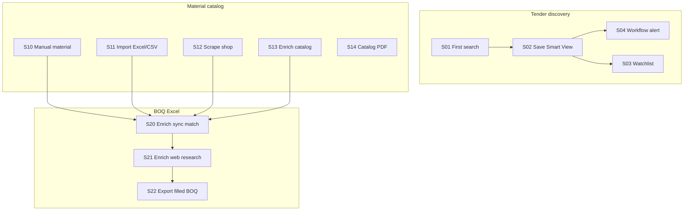

# BidTool v3 — MVP Scenarios

> Status: Draft (June 2026)  
> Purpose: Demo walkthroughs, acceptance checks, and test planning for the MVP.  
> Related: [workflows.md](../workflows.md) · [help content](../../src/app/_lib/help-content.ts)

---

## 1. What the MVP is

BidTool v3 is a **single-user local dashboard** (browser, on-prem Docker, or Electron desktop) for two daily jobs:

1. **Tender discovery** — search BidWinner public data, save filters, watch items, get alerts.
2. **Material catalog & BOQ prep** — build a product catalog, scrape shops, enrich rows, and fill Excel BOQ sheets from that catalog.

**In scope for MVP**

| Area | Routes | Notes |
|------|--------|-------|
| Dashboard | `/dashboard` | KPIs, recent jobs, quick actions |
| Tender search | `/search/*`, detail pages | Packages, location, area, KHLCNT, projects |
| Saved filters & watchlist | `/saved-items/*` | Smart Views, Watchlist |
| Workflows & alerts | `/workflows/*`, `/notifications` | Create from Smart View, run now, in-app notifications |
| Material catalog | `/materials/*` | CRUD, list, import Excel/CSV |
| Shop scrape → import | `/materials/scrape` | Playwright job, review, import to catalog |
| Catalog web enrichment | `/materials/enrich` | Background job, review, commit |
| Excel enrich | `/enrich`, `/enrich/jobs` | 4-step wizard + optional web research jobs |
| Catalog PDF library | `/catalog-pdfs/*` | Upload/link PDFs to materials |
| Unified jobs | `/jobs` | All background job families in one list |
| Settings | `/settings/*` | AI providers, app config, version |
| Help | `/help/*` | Operational guides |

**Out of scope for MVP** (schema or notes exist; not required to demo core value)

- Multi-tenant auth as default (`AUTH_ENABLED` optional, not the primary demo path)
- Gói thầu Excel workspace (`excel_workspaces` tables — no UI yet)
- Full BidWinner re-query on every workflow run (workflows today = metadata + notification)
- n8n / worker split (future architecture in `docs/architecture-option-b/`)

**Persona**

| | |
|--|--|
| **Who** | One estimator / procurement staff at a construction or MEP contractor in Vietnam |
| **Goal** | Find relevant tenders early, maintain a clean material catalog, and turn incomplete BOQ Excel into filled sheets |
| **Environment** | Local Postgres + app at `http://localhost:3000`, or on-prem / desktop pointing at same stack |
| **Language** | UI copy Vietnamese (`vi-VN`) |

---

## 2. Demo prerequisites

Before running scenarios, prepare:

| Item | How |
|------|-----|
| App running | `bun run dev:run` → open `http://localhost:3000` |
| Database | Postgres via Docker; migrations applied |
| Demo catalog (optional) | `ENABLE_DEMO_SEED="true"` in `.env`, then `bun run db:seed` |
| AI / web research | OpenRouter API key in Settings → AI providers (for enrich research scenarios) |
| Sample Excel BOQ | One `.xlsx` with columns like Tên vật tư, ĐVT, Thông số — many cells intentionally blank |
| Sample catalog import | One `.xlsx` or `.csv` with material rows (name, unit, price, manufacturer) |
| Shop URL | One e-commerce shop URL supported by scrape profiles (for scrape scenario) |
| BidWinner access | Network access to BidWinner public pages (search scenarios) |

**Demo files** (generate with `bun run demo:samples`):

```text
docs/demo/
  demo-catalog-6.xlsx      # 6 catalog rows for /materials/import
  demo-boq-6.xlsx          # 6 paired BOQ rows for /material-profiles
  README.md                # Paired workflow instructions
```

See also [docs/demo/README.md](../demo/README.md). For incomplete BOQ / enrich scenarios, use ad-hoc Excel with blank columns.

---

## 3. Scenario map (quick reference)



---

## 4. Tender discovery scenarios

### S01 — First tender search

**Goal:** Find packages matching keywords and region.

| | |
|--|--|
| **Preconditions** | App running; no saved data required |
| **Route** | `/search/packages` |

**Steps**

1. Open **Tìm kiếm → Gói thầu**.
2. Enter keyword (e.g. `cơ điện`, `thang máy`).
3. Set province and optional filters (budget, date, field).
4. Run search and wait for results.
5. Open one result → **Chi tiết gói thầu** page.
6. Optionally select rows and **Lưu vào DB** (persist locally).

**Expected outcome**

- Paginated results with match scores.
- Detail page shows parsed BidWinner fields and source link.
- Saved packages appear in local DB for later reference.

---

### S02 — Save a Smart View

**Goal:** Reuse a stable filter set without re-entering criteria.

| | |
|--|--|
| **Preconditions** | S01 completed with filters that return useful results |
| **Route** | `/search/packages` → `/saved-items/smart-views` |

**Steps**

1. From search results, click **Lưu bộ lọc** (save filter).
2. Name the Smart View (e.g. `Cơ điện HCM Q3/2026`).
3. Open **Bộ lọc & Watchlist → Smart Views**.
4. Apply the saved view and confirm results reload with same criteria.

**Expected outcome**

- Smart View listed with name and filter summary.
- Re-applying view restores filters and runs search.

---

### S03 — Add items to Watchlist

**Goal:** Track specific packages, plans, or projects for follow-up.

| | |
|--|--|
| **Preconditions** | At least one search result or detail page open |
| **Route** | Search detail or results → `/saved-items/watchlist` |

**Steps**

1. From a package detail or result row, add to **Watchlist**.
2. Repeat for a KHLCNT row (`/search/plans`) or project (`/search/projects`) if needed.
3. Open **Watchlist** and verify items grouped by type.

**Expected outcome**

- Watchlist shows saved references with links back to detail/search.
- Items persist across sessions.

---

### S04 — Workflow from Smart View → notification

**Goal:** Turn a Smart View into a repeatable alert workflow.

| | |
|--|--|
| **Preconditions** | S02 Smart View exists |
| **Route** | `/workflows` → `/notifications` |

**Steps**

1. Open **Quy trình → Danh sách**.
2. Create workflow **from Smart View** (select S02 view).
3. Configure name and schedule metadata (as supported).
4. Click **Chạy ngay** (`runNow`).
5. Open **Thông báo** and read the generated alert.
6. Optional: check **Quy trình → Trạng thái** / **Thông báo** sub-pages.

**Expected outcome**

- Workflow run recorded in run history.
- In-app notification created with link/context to the workflow.
- User can dismiss or follow notification to next action.

**MVP limitation:** `runNow` does not re-scrape BidWinner in background; it orchestrates metadata + notification. Full auto-search on schedule is a post-MVP enhancement.

---

### S05 — Multi-mode search exploration

**Goal:** Use all five BidWinner search modes appropriately.

| Mode | Route | When to use |
|------|-------|-------------|
| Gói thầu | `/search/packages` | Primary package discovery |
| Theo địa phương | `/search/packages/location` | One province scope |
| Ngành & địa phương | `/search/packages/area` | Taxonomy exploration |
| KHLCNT | `/search/plans` | Plans before packages |
| Dự án | `/search/projects` | Early pipeline |

**Expected outcome:** User understands which mode fits which procurement stage (see help **Tìm kiếm**).

---

## 5. Material catalog scenarios

### S10 — Create one material manually

**Goal:** Add a canonical product row before import or matching.

| | |
|--|--|
| **Preconditions** | Empty or existing catalog |
| **Route** | `/materials/new` → `/materials/[id]` |

**Steps**

1. Open **Sản phẩm / vật tư → Thêm thủ công** (or **Hồ sơ vật tư → Tạo hồ sơ mới**).
2. Fill **Tên**, **ĐVT**, **Giá**, **NCC**, **Thông số**, **Mã vật tư** (Item Code).
3. Save and open detail page.
4. Add a **price source** URL if applicable.

**Expected outcome**

- Material appears in `/materials` list.
- Detail shows all entered fields; list search finds by name.

---

### S11 — Import catalog from Excel or CSV

**Goal:** Bulk-load materials from an existing supplier sheet.

| | |
|--|--|
| **Preconditions** | Sample `catalog-seed.csv` or `.xlsx` |
| **Route** | `/materials/import` |

**Steps**

1. Upload file or paste CSV.
2. Review **Preview**: headers, row count, sample rows.
3. Map columns → Tên, ĐVT, Giá, Thông số, NCC, Xuất xứ, Mã.
4. Confirm import.
5. Open **Danh mục** — filter and spot-check imported rows.

**Expected outcome**

- Valid rows inserted; duplicates (same name + unit) skipped.
- Summary shows inserted / skipped counts.
- Imported materials available for Excel enrich matching.

---

### S12 — Scrape shop → review → import

**Goal:** Pull products from an e-commerce shop into the catalog.

| | |
|--|--|
| **Preconditions** | Valid shop URL; Playwright available in runtime |
| **Route** | `/materials/scrape` → `/materials/scrape/jobs/[jobId]` → `/jobs` |

**Steps**

1. Open **Scrape shop**.
2. Enter shop URL; set limits (pages/products) and scrape method.
3. Start job → monitor progress (pages visited, products collected).
4. When complete, review product table:
   - Fix suspicious names (promo badges, **KH** / Khấu hao noise).
   - Hide or exclude rows missing name/price if needed.
5. Select products → **Import vào danh mục**.
6. Monitor import job; verify new rows in `/materials`.

**Expected outcome**

- Scrape job completes with product JSON in job record.
- Import creates or merges materials (fuzzy match above threshold).
- Job visible on `/jobs` with terminal status.

**Known MVP gaps** (from backlog — document, do not block demo on perfect scrape):

- Wrong/unrelated names on some shops
- Single-page / single-product scrape edge cases
- Products with null fields not always persisted
- KH badge text still appearing in names/details

---

### S13 — Enrich existing catalog materials from web

**Goal:** Fill blank specs, manufacturer, images, and PDF links for saved materials.

| | |
|--|--|
| **Preconditions** | Materials with empty fields; OpenRouter configured |
| **Route** | `/materials/enrich` → `/materials/enrich/jobs/[jobId]` |

**Steps**

1. From **Danh mục**, select materials missing price or spec.
2. Open **Làm giàu hồ sơ** / `/materials/enrich`.
3. Start enrichment job with selected IDs.
4. Wait for job progress on job detail page.
5. For each item in review:
   - Inspect web candidates and evidence snippets.
   - Approve, reject, or pick alternate candidate.
6. **Commit** (single or bulk) — only blank fields filled unless overwrite policy set.
7. Verify updated rows in material detail.

**Expected outcome**

- Job statuses: queued → running → completed (or partial errors logged).
- Committed fields written to `materials`; catalog PDF links when found.
- Field locks respected if configured on material.

**Known MVP gap:** Review UI should show product images side-by-side for comparison (backlog).

---

### S14 — Catalog PDF library

**Goal:** Attach manufacturer PDF catalogs to materials.

| | |
|--|--|
| **Preconditions** | PDF file or download URL |
| **Route** | `/catalog-pdfs/new` → `/catalog-pdfs/[id]` |

**Steps**

1. Upload PDF or provide URL.
2. Set title, manufacturer, metadata.
3. Link PDF to one or more materials.
4. Open material detail → confirm catalog section shows linked PDF.
5. Optional: filter materials that have / lack catalog (when column/filter shipped).

**Expected outcome**

- PDF stored and served via file API.
- Links visible on material detail; library lists all documents.

---

## 6. Excel BOQ scenarios

### S20 — Excel enrich: upload → catalog match → export (no web)

**Goal:** Fill blank BOQ cells from local catalog only — fastest happy path.

| | |
|--|--|
| **Preconditions** | S11 or S12 populated catalog; `boq-incomplete.xlsx` |
| **Route** | `/enrich` |

**Steps**

1. **Bước 1 — Upload:** Select BOQ `.xlsx`; confirm sheet and column mapping.
2. **Bước 2 — Đối chiếu:**
   - Review **Auto** rows (score ≥ 0.85).
   - Resolve **Cần duyệt** rows — pick correct material card or search manually.
   - Note **Chưa khớp** rows for optional step 3.
   - Toggle which blank fields to accept per row (`acceptedFields`).
3. Skip **Bước 3 — Nghiên cứu web** (or leave unmatched).
4. **Bước 4 — Xuất:** Download enriched workbook (preserve layout mode).

**Expected outcome**

- Only **blank** cells filled from chosen catalog material; existing cell values untouched.
- Export downloads `.xlsx` with filled specs, prices, manufacturers where matched.
- Unmatched rows unchanged.

**Fill rules (acceptance):**

| Rule | Behavior |
|------|----------|
| Blank cell | Filled from catalog if user accepted field |
| Existing value | Never overwritten (default) |
| User override | Per-field checkbox / force toggle when offered |

---

### S21 — Excel enrich: web research job for unmatched rows

**Goal:** Use AI + web search for rows the catalog cannot match.

| | |
|--|--|
| **Preconditions** | S20 with unmatched rows; OpenRouter + search provider configured |
| **Route** | `/enrich` step 3 → `/enrich/jobs`, `/enrich/jobs/[jobId]` |

**Steps**

1. From enrich wizard step 2, proceed to **Nghiên cứu web** with unmatched rows.
2. Create/start Excel research job.
3. Monitor job on `/enrich/jobs/[jobId]` — row statuses, evidence, confidence.
4. Approve/reject rows; use bulk approve where appropriate.
5. Return to export step or export from job detail.

**Expected outcome**

- Each researched row has evidence (URL + snippet) and suggested field values.
- Approved rows merge into fill plan for export.
- Job listed on `/jobs` and `/enrich/jobs`.

**Known MVP gaps:**

- Job list on `/enrich` should show ongoing/cancelled jobs inline (backlog)
- Bulk commit UX on research jobs needs parity with catalog enrich
- Step 3 quick-row path should align with full job review logic

---

### S22 — End-to-end BOQ prep (catalog → enrich → deliver)

**Goal:** Full story for a bid coordinator preparing a pricing sheet.

| | |
|--|--|
| **Preconditions** | Supplier CSV + incomplete BOQ + optional shop URL |
| **Routes** | S11 → S20 → (optional S21) → export |

**Steps**

1. Import supplier catalog (S11).
2. Scrape one shop for missing specialty items (S12).
3. Enrich sparse catalog rows (S13) for critical SKUs.
4. Run Excel enrich (S20) on BOQ; research gaps (S21) if needed.
5. Download final Excel and spot-check 5 random rows against catalog detail pages.

**Expected outcome**

- BOQ row count unchanged; fill rate improved on target columns.
- Traceability: user can open matched material from catalog for any filled row.

---

## 7. Operations & dashboard scenarios

### S30 — Morning check-in

**Goal:** See what needs attention today.

| | |
|--|--|
| **Route** | `/dashboard` → `/notifications`, `/jobs` |

**Steps**

1. Open **Tổng quan** — read KPI cards (material count, missing price, running jobs, unread notifications).
2. Click through recent scrape/import jobs.
3. Open unread notifications from workflows.
4. Open **Danh sách job** for any stuck queued jobs.

**Expected outcome:** User knows running work, failures, and alert backlog in under 2 minutes.

---

### S31 — Configure AI provider

**Goal:** Enable web research and enrichment features.

| | |
|--|--|
| **Route** | `/settings` (AI providers section) |

**Steps**

1. Add OpenRouter API key and default model.
2. Save and run a single-row web research or material enrich smoke test.

**Expected outcome:** Research jobs move past `running` without provider auth errors.

---

### S32 — Desktop or on-prem smoke

**Goal:** Confirm non-web surfaces serve the same workflows.

| Surface | Check |
|---------|-------|
| On-prem Docker | `bun run onprem:install`, open app, run S01 + S20 |
| Electron desktop | `bun run desktop:dev`, verify server URL or bundled server |
| Version | Settings → About shows version; update banner if newer manifest |

---

## 8. Cross-domain demo script (15-minute MVP pitch)

Use this single narrative for demos, recordings, or UAT sign-off.

| Min | Scene | Scenario IDs |
|-----|-------|----------------|
| 0–2 | Open dashboard; show tender + catalog KPIs | S30 |
| 2–5 | Search packages in HCM; save Smart View; add one to Watchlist | S01, S02, S03 |
| 5–6 | Create workflow; run now; show notification | S04 |
| 6–9 | Import small CSV catalog; show list | S11 |
| 9–12 | Upload BOQ Excel; auto-match; fix one review row; export | S20 |
| 12–14 | Optional: start scrape or enrich job; show `/jobs` | S12 or S13 |
| 14–15 | Recap: one tool for **tìm thầu** + **chuẩn hóa vật tư** + **điền BOQ** | — |

---

## 9. Acceptance checklist (MVP done)

### Tender

- [ ] All five search modes return results with BidWinner source banner
- [ ] Detail pages load for package, plan, project
- [ ] Smart View save/list/apply works
- [ ] Watchlist add/list/remove works
- [ ] Workflow create + run now + notification delivery works

### Catalog

- [ ] Manual CRUD on materials
- [ ] Excel/CSV import with preview and column mapping
- [ ] Shop scrape job completes and import creates materials
- [ ] Material enrichment job commits blank fields with evidence
- [ ] Catalog PDF upload and link to material

### Excel enrich

- [ ] 4-step wizard: upload → match → research (optional) → export
- [ ] Fill-empty semantics on export
- [ ] Excel research job approve/reject/export path works

### Platform

- [ ] `/jobs` lists all job types
- [ ] Dashboard KPIs load without timeout
- [ ] Help pages reachable for search, import, workflows
- [ ] `bun run check` and `bun run test` pass on release branch

---

## 10. Post-MVP backlog (from product notes)

Track separately — not required for MVP sign-off:

| Item | Notes |
|------|-------|
| Scrape name quality | Wrong names, KH/Khấu hao noise, null-field drops |
| Scrape pagination bugs | Single page / single product edge cases |
| Catalog column in list | Show which materials have linked PDF |
| Field locks UI | Prevent scrape/import overwrite on protected fields |
| AI product match on import | Better matching for import/mapping |
| List STT column | Row index in material table |
| Merge Thông số + Chi tiết | Single spec/detail field; clarify Mã vật tư |
| Enrich job list on `/enrich` | Ongoing/cancelled jobs inline |
| Bulk commit UX | Research + enrichment review at scale |
| Image comparison in enrich review | Side-by-side in Duyệt enrichment |
| Gói thầu workspace | Excel workspace per tender package (DB ready, no UI) |
| Demo assets | Sample files, test email, dedicated OpenRouter project |

---

## 11. Scenario → route index

| ID | Title | Primary route |
|----|-------|---------------|
| S01 | First tender search | `/search/packages` |
| S02 | Save Smart View | `/saved-items/smart-views` |
| S03 | Watchlist | `/saved-items/watchlist` |
| S04 | Workflow alert | `/workflows`, `/notifications` |
| S05 | Multi-mode search | `/search/*` |
| S10 | Manual material | `/materials/new` |
| S11 | Import catalog | `/materials/import` |
| S12 | Scrape shop | `/materials/scrape` |
| S13 | Enrich catalog | `/materials/enrich` |
| S14 | Catalog PDF | `/catalog-pdfs` |
| S20 | Excel enrich sync | `/enrich` |
| S21 | Excel web research | `/enrich/jobs` |
| S22 | E2E BOQ prep | `/materials/import` → `/enrich` |
| S30 | Morning check-in | `/dashboard` |
| S31 | AI provider setup | `/settings` |
| S32 | Desktop/on-prem smoke | varies |
