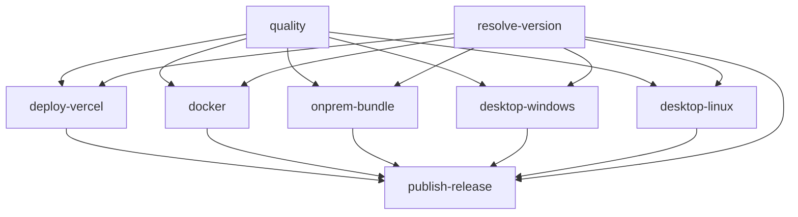

# CI/CD Review

Overview of GitHub Actions workflows and how they relate to the update system.

## Workflows

| Workflow | Trigger | Purpose |
| --- | --- | --- |
| [`.github/workflows/ci.yml`](../../.github/workflows/ci.yml) | Push/PR to `main` | Lint, typecheck, test, build, validate release scripts, smoke-build on-prem Docker |
| [`.github/workflows/release.yml`](../../.github/workflows/release.yml) | Tag `v*` or manual dispatch | Unified release for web, on-prem, desktop, manifest, pins |
| [`.github/workflows/rollback.yml`](../../.github/workflows/rollback.yml) | Manual dispatch | Re-promote pinned web deployment and retag on-prem `:latest` |

## CI (`ci.yml`)

Runs on every PR and `main` push:

1. **check** — lint, typecheck, test, production build
2. **release-scripts** — validates `releases/pins.json`, manifest generation, and `release-cli status`
3. **onprem** — validates `compose.production.yml` and builds the Docker image (no push)

CI does **not** deploy anywhere. It guards code quality and release script correctness.

## Release (`release.yml`)

### Job graph

### Web deploy details

The `deploy-vercel` job:

1. Pulls Vercel project settings (`vercel pull`)
2. Builds with `vercel build --prod` using release env vars (`BIDTOOL_*`)
3. Deploys with `vercel deploy --prebuilt --prod --json`
4. Stores the real Vercel deployment ID (`dpl_...`) in `manifest.json` and `pins.json`

If Vercel secrets are missing, web promotion is skipped and `deployment_id=skipped` is recorded.

### Pins commit

After publishing, `publish-release` updates `releases/pins.json` and commits it to **`main`**, not the tag ref. This keeps the pins registry on the default branch for rollback and runtime version checks.

### Required secrets

| Secret | Used by |
| --- | --- |
| `GITHUB_TOKEN` | Release publish, GHCR push, pins commit |
| `VERCEL_TOKEN` | Web deploy and rollback |
| `VERCEL_ORG_ID` | Web deploy |
| `VERCEL_PROJECT_ID` | Web deploy |

### Vercel project settings

1. Disable automatic production deploys from `main`
2. Set production runtime env vars (or use Vercel dashboard values that match release metadata):
   - `BIDTOOL_DEPLOYMENT_SURFACE=web`
   - `DATABASE_URL`, `APP_BASE_URL`, etc.

Release workflow embeds version metadata at **build time** via job env. Runtime env on Vercel should still identify the deployment surface.

## Rollback (`rollback.yml`)

Manual workflow with input `target_version` (for example `0.1.0`):

1. Loads pin from `releases/pins.json`
2. Promotes pinned Vercel deployment by deployment ID
3. Retags pinned on-prem digest (or image ref) as GHCR `:latest`

Does **not** roll back desktop installs or database migrations.

## Release CLI

Maintainers should prefer the release CLI over manual tags. See [Release CLI](./release-cli.md).

## Known limits

| Area | Limit |
| --- | --- |
| Web without Vercel secrets | Release continues; web pin marked `skipped` |
| First release | `pins.json` starts empty until first successful release |
| On-prem bundle | Ships `releases/pins.json` snapshot; latest manifest comes from GitHub Release after publish |
| DB rollback | Not supported — use forward hotfix releases |

Maintainer tagging commands: [Release CLI](./release-cli.md).

## Related docs

- [Operating guide](./operating-guide.md)
- [Update flows](./flows.md)
- [Rollback](./rollback.md)
