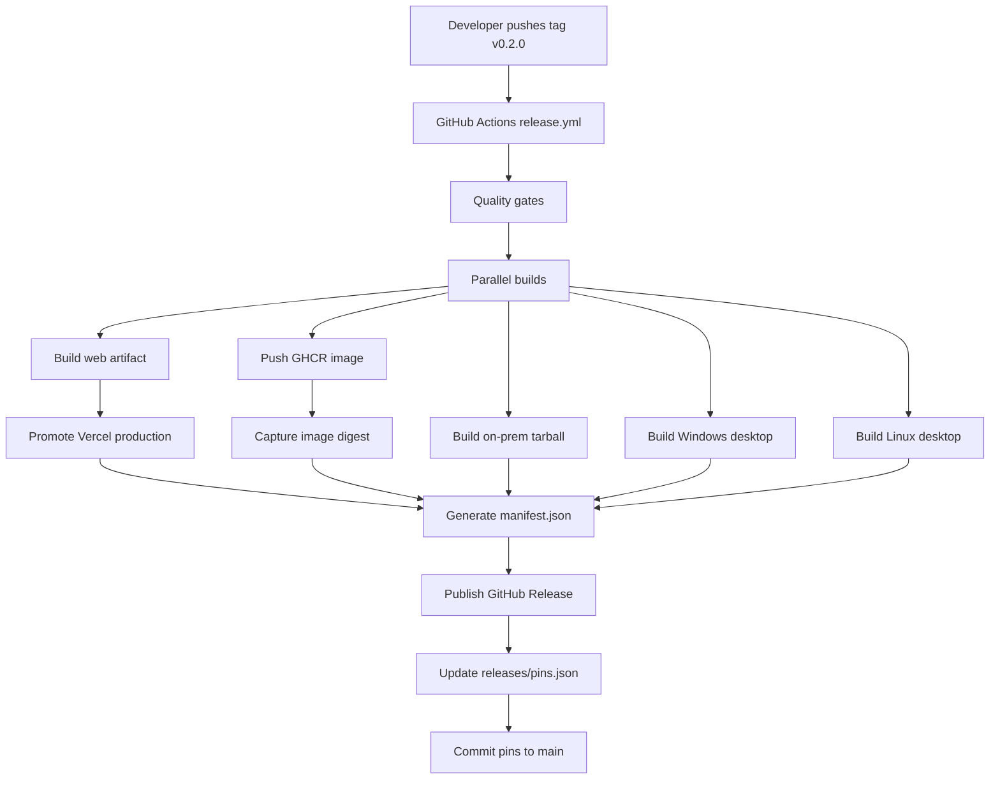
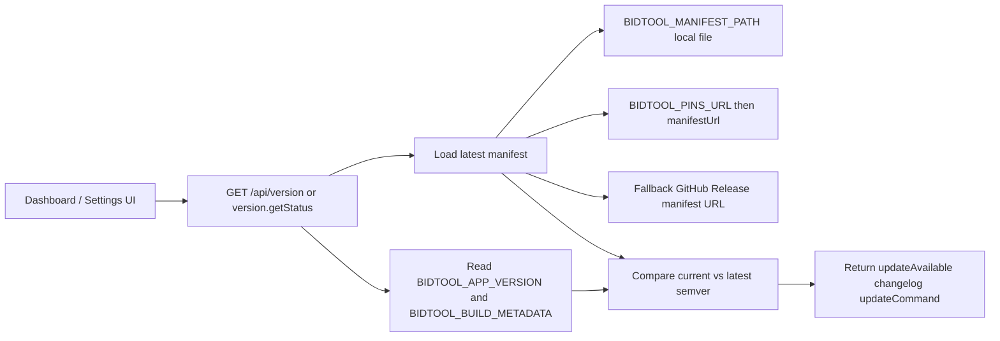
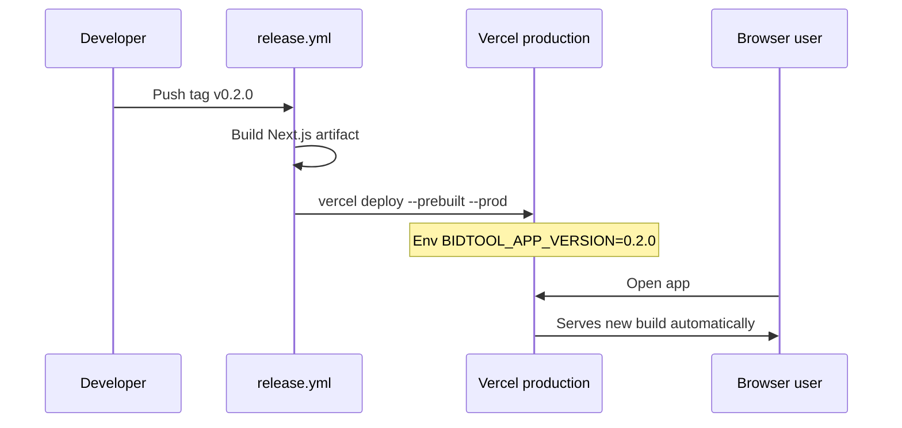
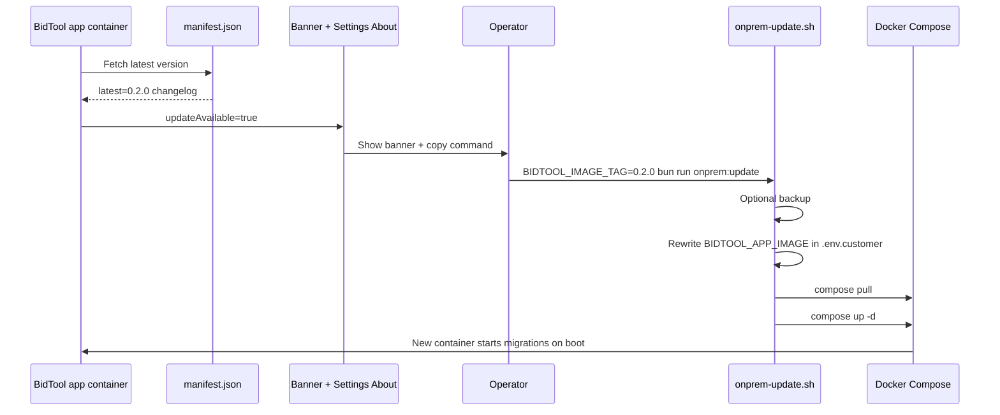
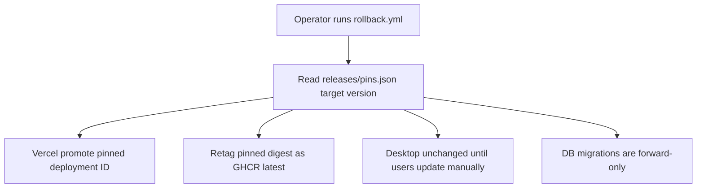
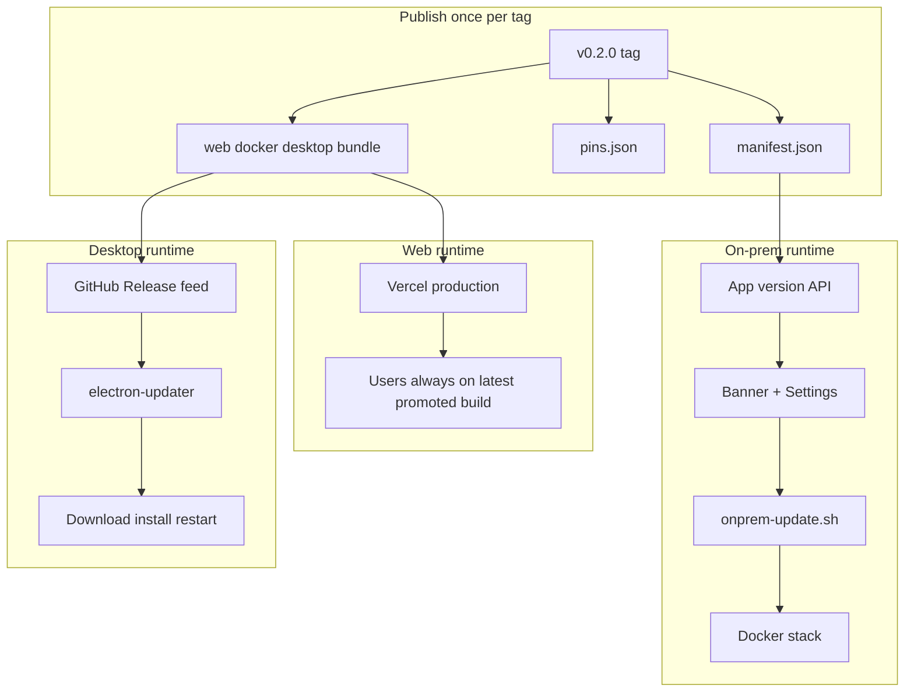

# Update Flows

This page describes how updates move through BidTool for each surface: release, runtime checks, apply, and rollback.

## 1. Unified release flow

One Git tag (`v0.2.0`) is the release unit. CI builds every artifact, writes one manifest, and commits artifact pins.



**Outcome**

| Artifact | Where it lands | Version example |
| --- | --- | --- |
| Web | Vercel production deployment | `0.2.0+web.abc1234` |
| On-prem | `ghcr.io/.../bidtoolv3:0.2.0` and `:latest` | `0.2.0+onprem.abc1234` |
| Desktop | GitHub Release `.exe` / `.AppImage` | `0.2.0+desktop.win.abc1234` |
| Metadata | Release asset `manifest.json` | semver `0.2.0` |
| Pins | Committed `releases/pins.json` | deployment ID, digest, URLs |

Web production does **not** update from every `main` push. It moves only when the release workflow promotes a tagged build.

---

## 2. Runtime version check flow

Every running instance can answer: *what am I on?* and *is something newer available?*



**Resolution order**

1. **Current version** — from env (`BIDTOOL_APP_VERSION`, `BIDTOOL_BUILD_METADATA`, `BIDTOOL_DEPLOYMENT_SURFACE`)
2. **Latest version** — from manifest, loaded via:
   - local file (`BIDTOOL_MANIFEST_PATH`) for air-gapped on-prem, or
   - `releases/pins.json` → `manifestUrl`, or
   - GitHub Release `manifest.json` fallback
3. **Response** — includes `updateAvailable`, `changelog`, and (for on-prem) `updateCommand`

Manifest data is cached in memory for about 10 minutes.

---

## 3. Web flow

Web has no in-app “Apply update” button. Users always hit whatever production deployment the release pipeline last promoted.



**Settings → About** on web shows version info and notes that production is managed by the release pipeline. No manual update step.

---

## 4. On-prem flow (hybrid)

The app **detects** updates and **guides** ops. The app does **not** run `docker compose pull` itself.



**Operator steps**

1. See dismissible banner or open **Settings → About**
2. Copy `BIDTOOL_IMAGE_TAG=0.2.0 bun run onprem:update`
3. Run on the host (SSH or automation), not inside the app container
4. Script pulls the pinned image, recreates the stack, migrations run on container start

**Air-gapped**

Bundle includes `releases/`. Set `BIDTOOL_MANIFEST_PATH` or `BIDTOOL_MANIFEST_URL` to a local manifest copy so the app can compare versions without reaching GitHub.

---

## 5. Desktop flow

Desktop has two parts:

- **Shell** — Electron app, updated via `electron-updater`
- **Server** — either bundled local Next server or remote on-prem URL

```mermaid
flowchart TD
  subgraph shell [Desktop shell update]
    start[App startup] --> check[autoUpdater check GitHub Release]
    poll[Poll every 30 min] --> check
    manual[Settings About Check for update] --> check
    check --> available{Update available?}
    available -->|yes| pill[Sidebar update pill]
    pill --> download[User clicks Download]
    download --> ready[Update downloaded]
    ready --> confirm[User confirms install]
    confirm --> restart[quitAndInstall restart]
  end

  subgraph server [Server version shown in Settings]
    remote[Remote on-prem URL configured] --> versionApi[/api/version on server]
    bundled[Bundled local server] --> versionApi
    versionApi --> about[Settings About server version row]
  end
```

**Typical user path**

1. Sidebar pill appears when an update is available
2. User downloads the update (or retries from Settings → About)
3. User confirms install — warned that running tasks may be interrupted
4. App restarts on the new shell version

**Remote server mode**

Electron shell and on-prem server update independently. Settings shows server version from `/api/version`; shell updates from GitHub Releases.

**Local dev / testing**

```bash
bun run start:mock-update-server
BIDTOOL_DESKTOP_MOCK_UPDATES=1 bun run desktop:start
```

Mock server serves artifacts from `release-mock/` instead of GitHub.

---

## 6. Rollback flow

Rollback re-promotes **pinned artifacts**. It does not rebuild old code.



| Surface | Rollback behavior |
| --- | --- |
| Web | Vercel promotes previous deployment from pin |
| On-prem | `:latest` image retagged to previous digest |
| Desktop | Users stay on installed version until they update |
| Database | **Not rolled back** — ship forward hotfix if schema drift breaks old app |

If migrations already ran, prefer a hotfix tag (`v0.2.1`) over rolling back app code.

---

## 7. End-to-end picture



---

## Related docs

- [Phase 1: Release orchestrator](./phase-1-release-orchestrator.md)
- [Phase 2: Version API](./phase-2-version-api.md)
- [Phase 3: Desktop UX](./phase-3-desktop-ux.md)
- [Phase 4: On-prem admin UI](./phase-4-onprem-admin-ui.md)
- [Rollback](./rollback.md)
- [Local development](./local-dev.md)
