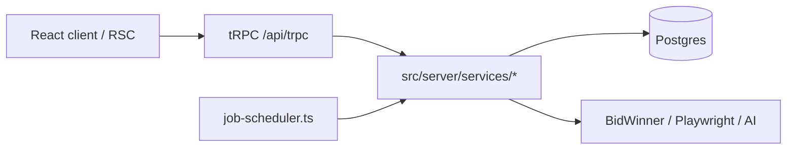
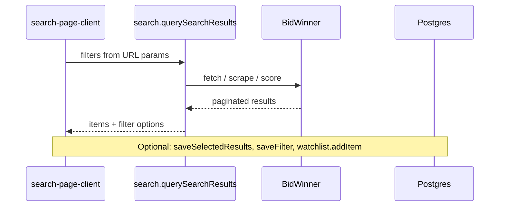
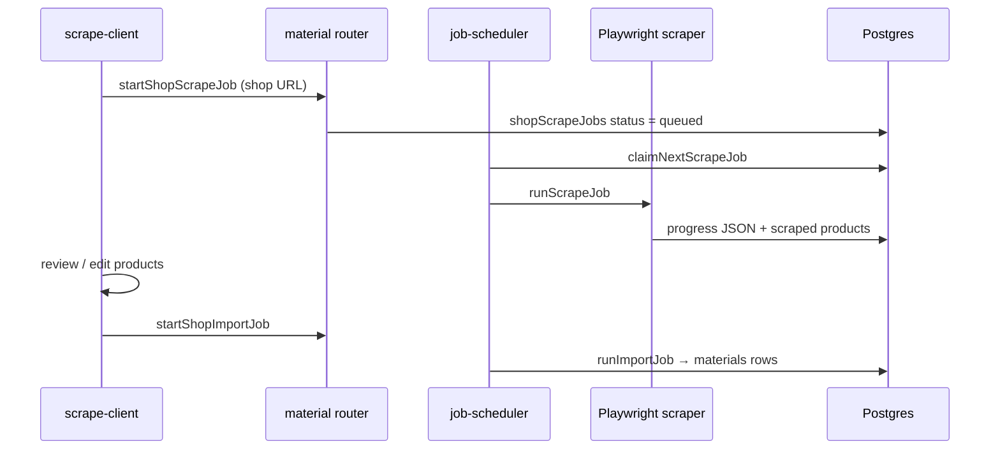
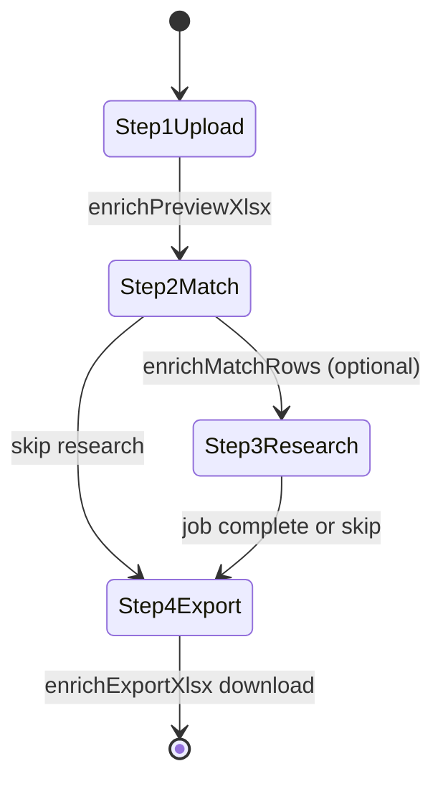

# Main Workflows

Overview of how the primary BidTool v3 features connect — routes, tRPC procedures, services, and background jobs. For deep dives on individual features, see [Related documentation](#related-documentation).

**Stack:** Next.js App Router · tRPC · Drizzle/Postgres · TanStack Query · optional Better Auth (`AUTH_ENABLED=true`)

---

## Architecture spine

All server logic goes through **tRPC** at `/api/trpc`. There are no Next.js server actions.

| Layer | Location |
|-------|----------|
| tRPC entry | `src/app/api/trpc/[trpc]/route.ts` |
| Router map | `src/server/api/root.ts` |
| Auth & permissions | `src/server/api/trpc.ts`, `src/lib/permissions.ts` |
| Tenant scoping | `src/server/api/tenant-scope.ts` |
| DB schema | `src/server/db/schema.ts` |
| Sidebar / feature nav | `src/app/_components/dashboard/dashboard-layout.tsx` |

### Client ↔ server data flow

1. Browser components call `api.<router>.<procedure>.useQuery` / `useMutation` (`~/trpc/react`).
2. RSC pages may prefetch via `~/trpc/server` and hydrate with `HydrateClient`.
3. Procedures validate input, check permissions, then delegate to services.
4. Services read/write Postgres and call external systems (BidWinner HTML, Playwright, AI providers).

### tRPC routers

Defined in `src/server/api/root.ts`:

| Router | Primary domain |
|--------|----------------|
| `search` | BidWinner tender search, saved filters |
| `watchlist` | Saved tender/material references |
| `workflow` | Alert workflows and runs |
| `notification` | In-app notifications |
| `material` | Catalog CRUD, import, Excel enrich (sync) |
| `materialEnrichment` | Catalog web-enrichment jobs |
| `excelResearch` | Excel row web-research jobs |
| `catalogDocument` | Catalog PDF library |
| `ai` | Chat sandbox / AI dispatch |
| `appConfig`, `tenant`, `user`, `version` | Settings and admin |

---

## Background job scheduler

Long-running work uses an **in-process scheduler** (not Redis/Bull). It starts on Node boot via `instrumentation.ts` → `startJobScheduler()` in `src/server/services/job-scheduler.ts`.

| Setting | Value |
|---------|-------|
| Poll interval | 1 s |
| Progress write throttle | 2 s |
| Expired job cleanup | hourly |
| Runs in | Next.js Node process (skipped on serverless / missing `DATABASE_URL`) |

Four job families share the poll loop:

| Job table | Service | UI |
|-----------|---------|-----|
| `shopScrapeJobs` | `shop-material-scraper.ts` | `/materials/scrape` |
| `shopImportJobs` | `shop-product-importer.ts` | `/materials/scrape/jobs/[jobId]` |
| `materialEnrichmentJobs` | `material-enrichment-runner.ts` | `/materials/enrich` |
| `excelResearchJobs` | `excel-research/process-batch.ts` | `/enrich/jobs` |

Unified job list: `/jobs` (`jobs-list-client.tsx`).

Concurrency limits come from `app_settings` (see `src/server/services/app-settings.ts`).

---

## 1. Tender search (BidWinner)

**Purpose:** Live search of packages (gói thầu), plans (KHLCNT), and projects from BidWinner.

| | |
|--|--|
| **Routes** | `/search/packages`, `/search/packages/location`, `/search/packages/area`, `/search/plans`, `/search/projects` |
| **Detail pages** | `/package-details/[externalId]`, `/plan-details/[externalId]`, `/project-details/[externalId]` |
| **Client** | `search-page-client.tsx`, `use-search-page-state.ts` |
| **Router** | `search.ts` |
| **Services** | `bidwinner-public-search.ts`, `bidwinner-search.ts`, `bidwinner-detail.ts`, `bidwinner-page-cache.ts` |

| Step | What happens |
|------|----------------|
| 1 | User sets filters → URL search params update |
| 2 | `search.querySearchResults` (or mode-specific `queryPackages`, etc.) |
| 3 | `queryBidWinnerPublicSearch()` fetches/scrapes BidWinner, scores matches, paginates |
| 4 | Detail view → `search.getSourceDetails` → `fetchBidWinnerSourceDetail()` (cached HTML parse) |
| 5 | Optional: `saveSelectedResults` persists packages/plans/projects locally |
| 6 | Optional: save Smart View → `saveFilter` / `updateSavedFilter` |
| 7 | Optional: `watchlist.addItem` |

**Sync only** — no background job.

---

## 2. Smart views, watchlist, and workflows

| Feature | Route | Key procedures |
|---------|-------|----------------|
| Smart Views | `/saved-items/smart-views` | `search.saveFilter`, `updateSavedFilter`, list/delete |
| Watchlist | `/saved-items/watchlist` | `watchlist.addItem`, list/remove |
| Workflows | `/workflows`, `/workflows/[id]`, `/workflows/[id]/runs` | `workflow.create`, `createFromSavedFilter`, `runNow` |
| Workflow health | `/workflows/health`, `/workflows/alerts` | health/status queries |
| Notifications | `/notifications` | `notification` router |

**Workflow `runNow` today:** inserts a `workflowRuns` row and creates an in-app notification. It does **not** re-query BidWinner in the background. Workflows are orchestration metadata plus alert delivery; heavy search runs when users search manually.

**Tables:** `savedFilters`, `watchlistItems`, `workflows`, `workflowRuns`, `notifications`

---

## 3. Material catalog (CRUD and import)

**Purpose:** Central product/material catalog used by matching, enrichment, and scrape import.

| | |
|--|--|
| **Routes** | `/materials`, `/materials/new`, `/materials/[id]`, `/materials/[id]/edit`, `/materials/import` |
| **Client** | `list-client.tsx`, `new-client.tsx`, `import-client.tsx`, detail layouts |
| **Router** | `material.ts` |
| **Table** | `materials` (+ catalog document links) |

| Step | Procedure / service |
|------|---------------------|
| Preview upload | `material.previewMaterialsXlsx` or client-side CSV parse |
| Import | `material.importMaterialsXlsx` / `importMaterialsCsv` → `importMaterialRows()` |
| List / manage | `searchMaterials`, `getMaterialSummary`, `deleteMaterial`, `bulkUpdateMaterials`, price source CRUD |

See [temp/materials.md](./temp/materials.md) for UI state, validation, and indexing details.

---

## 4. Shop scrape → import

**Purpose:** Scrape e-commerce shop URLs with Playwright, review products, import into the catalog.

| | |
|--|--|
| **Routes** | `/materials/scrape`, `/materials/scrape/jobs/[jobId]` |
| **Client** | `scrape-client.tsx` |
| **Router** | `material.startShopScrapeJob`, `listShopScrapeJobs`, `getShopScrapeJob`, product edit mutations, `startShopImportJob` |
| **Services** | `shop-scrape-jobs.ts`, `shop-material-scraper.ts`, `shop-import-jobs.ts`, `shop-product-importer.ts` |
| **Tables** | `shopScrapeJobs`, `shopImportJobs` |

After import, fuzzy match suggestions may appear in **match review** (section 5).

---

## 5. Match review

**Purpose:** Human review of post-scrape catalog match suggestions.

| | |
|--|--|
| **Route** | `/materials/match-review` |
| **Client** | `match-review-client.tsx` |
| **Router** | `material.listPendingMatches`, `acceptMatch`, `rejectMatch`, `bulkAcceptMatches` |
| **Service** | `ai-product-matcher.ts` (pg_trgm scoring) |
| **Table** | `materialMatchDecisions` |

Flow: pending scrape→catalog matches → accept/reject → updates material linkage.

---

## 6. Excel enrich — sync catalog match

**Purpose:** Upload an Excel BOQ, map columns, match rows to the local catalog, fill missing fields, export.

| | |
|--|--|
| **Route** | `/enrich` (`/research-enrich` redirects here) |
| **Client** | `enrich-client.tsx` (4-step wizard) |
| **Router** | `material.enrichPreviewXlsx`, `enrichMatchRows`, `enrichSearchMaterials`, `enrichWebSearchRow`, `enrichExportXlsx` |
| **Services** | `excel-enrich.ts`, `excel-workbook.ts`, `enrich-web-row.ts` |

| Step | UI | Server |
|------|-----|--------|
| 1 Upload / map | File → base64 | `enrichPreviewXlsx` — parse workbook, suggest column mapping |
| 2 Catalog match | Review auto / review / unmatched rows | `enrichMatchRows` → `excel-enrich.ts` fuzzy match against local catalog |
| 3 Web research (optional) | `enrich-research-step.tsx` | Creates async Excel Research job; per-row quick path: `enrichWebSearchRow` |
| 4 Export | Download | `enrichExportXlsx` → `writeEnrichedWorkbook` |

The client builds the fill plan (`buildFillPlan` in `src/lib/materials/excel-enrich-fields.ts`) from user decisions — chosen material, accepted fields, overwrite flags, value overrides — before export.

See [temp/enrich.md](./temp/enrich.md) and [temp/excel-enrich-export-plan.md](./temp/excel-enrich-export-plan.md) for parsing, scoring, and export mechanics.

---

## 7. Excel research jobs — async web + AI

**Purpose:** Batch web and AI research per Excel row with review workflow and evidence.

| | |
|--|--|
| **Routes** | `/enrich/jobs`, `/enrich/jobs/[jobId]` |
| **Clients** | `enrich-research-step.tsx`, `enrich-jobs-client.tsx`, `excel-research-job-detail.tsx` |
| **Router** | `excel-research.ts` |
| **Services** | `excel-research-jobs.ts`, `process-batch.ts`, `row-research.ts`, `excel-research-storage.ts` |
| **Tables** | `excelResearchJobs`, `excelResearchJobRows`, evidence/artifact/changelog tables |

| Step | Function |
|------|----------|
| 1 | `excelResearch.createJob` — stores workbook + row seeds |
| 2 | `excelResearch.startJob` — status → `running` |
| 3 | Scheduler → `processJobBatch` → per row `processSingleRow()`: catalog match → web search → AI extract → rank evidence |
| 4 | UI polls `getJobStatus`, `listRowResults`; user `approveRow` / `rejectRow` / `bulkApproveRows` |
| 5 | `excelResearch.exportExcel` — enriched workbook artifact |

See [temp/excel-product-research.md](./temp/excel-product-research.md) for row processing, evidence model, and export rules.

---

## 8. Material enrichment jobs — enrich existing catalog items

**Purpose:** Enrich existing catalog materials from the web (specs, PDFs, manufacturer, etc.).

| | |
|--|--|
| **Routes** | `/materials/enrich`, `/materials/enrich/jobs/[jobId]` |
| **Client** | `materials/enrich-client.tsx` |
| **Router** | `material-enrichment.ts` |
| **Services** | `material-enrichment-jobs.ts`, `material-enrichment-runner.ts`, `material-enrichment-commit.ts`, `material-web-search.ts` |
| **Tables** | `materialEnrichmentJobs`, `materialEnrichmentItems`, `materialWebCandidates` |

| Step | Function |
|------|----------|
| 1 | `materialEnrichment.startMaterialEnrichmentJob` with material IDs + options |
| 2 | Scheduler → `processEnrichmentJob` per item: web search → rank → AI extract; optional auto-commit |
| 3 | UI: `selectWebCandidate`, approve/reject, `commitMaterialEnrichmentItem`, `bulkCommitMaterialEnrichment` |
| 4 | Commit writes back to `materials` + catalog PDF links |

See [temp/material-enrichment.md](./temp/material-enrichment.md) for fill-empty semantics, field locks, and commit policy.

---

## 9. Catalog PDF library

**Purpose:** Store and link manufacturer catalog PDFs to materials.

| | |
|--|--|
| **Routes** | `/catalog-pdfs`, `/catalog-pdfs/new`, `/catalog-pdfs/[id]` |
| **Client** | `catalog-pdf-library-client.tsx` |
| **Router** | `catalog-document.ts` |
| **Services** | `catalog-pdf-storage.ts`, `catalog-documents.ts`, `catalog-pdf-generator.ts` |
| **File API** | `/api/catalog-pdfs/[id]/file/route.ts` |

Flow: upload PDF / URL / download from source → store on disk → link to materials via `materialCatalogDocumentLinks`.

---

## 10. Unified jobs list

**Route:** `/jobs` — aggregates all four job families in `jobs-list-client.tsx`.

---

## 11. Supporting surfaces

| Surface | Route | Notes |
|---------|-------|-------|
| Dashboard | `/dashboard` | Server component reads `getDashboardSnapshot()` — KPIs, recent workflows, alerts |
| Settings | `/settings/*` | Users, tenants, AI providers, desktop — `user`, `tenant`, `appConfig`, `ai` routers |
| Portal | `/portal` | Customer read-only; prefetches notifications, jobs, watchlist |
| Chat sandbox | `/chat` | `ai` router + OpenRouter |
| Setup | `/setup`, `/api/setup` | First-run configuration |
| Documents hub | `/documents` | Shortcut links only (not a workflow) |

---

## Two “enrich” flows compared

| | **Excel Enrich** (`/enrich`) | **Material Enrichment** (`/materials/enrich`) |
|--|------------------------------|-----------------------------------------------|
| Input | Excel workbook rows | Existing `materials` IDs |
| Match | Sync fuzzy catalog match | Web search + AI extract |
| Jobs | Optional `excelResearch` job (step 3) | `materialEnrichment` async job |
| Output | Filled Excel export | Updated material records + PDFs |

Both share fill-empty semantics and evidence-backed suggestions; see the linked feature docs for export/commit rules.

---

## Key orchestration files

| File | Role |
|------|------|
| `src/server/api/root.ts` | tRPC API surface |
| `instrumentation.ts` | Scheduler + desktop admin bootstrap |
| `src/server/services/job-scheduler.ts` | Background job polling and claims |
| `src/server/services/excel-enrich.ts` | Excel ↔ catalog matching core |
| `src/server/services/bidwinner-public-search.ts` | Tender search orchestration |
| `src/server/services/shop-material-scraper.ts` | Playwright shop scraping |
| `src/app/_components/dashboard/dashboard-layout.tsx` | Feature navigation map |

---

## Related documentation

| Doc | Contents |
|-----|----------|
| [temp/enrich.md](./temp/enrich.md) | Excel enrich UI state machine, parsing, fuzzy match algorithm |
| [temp/excel-product-research.md](./temp/excel-product-research.md) | Excel research jobs (step 3), row processing, evidence |
| [temp/material-enrichment.md](./temp/material-enrichment.md) | Catalog web enrichment jobs, commit policy |
| [temp/materials.md](./temp/materials.md) | Material catalog CRUD, import, list UI |
| [temp/auth-and-rbac.md](./temp/auth-and-rbac.md) | Auth and permissions (when `AUTH_ENABLED=true`) |
| [updates/flows.md](./updates/flows.md) | Release and update flows (not app feature workflows) |
| [architecture-option-b/README.md](./architecture-option-b/README.md) | Future target architecture (worker split, monorepo) |

---

## Out of scope for this page

- REST routes beyond tRPC are minimal: auth, health, version, setup, catalog PDF file serving.
- `/import-mapping` redirects to `/materials/import`.
- Future worker process split is described in `docs/architecture-option-b/05-worker-and-scraper.md`; the scheduler currently runs inside the Next.js Node process.
