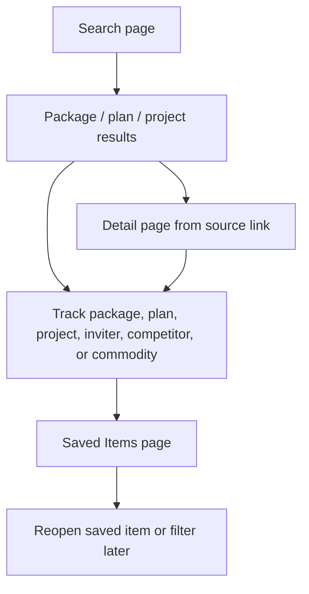
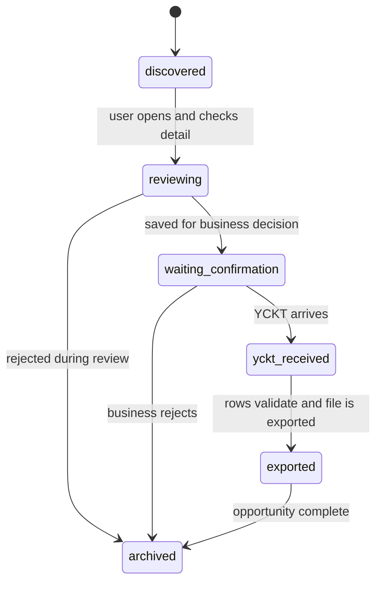

# Workflow 01 - Search Package, Review, Export YCKT Excel

## Goal

Turn a tender-search result into a reviewed opportunity and, after business
confirmation, export a structured YCKT workbook.

Target flow:

`search -> open source detail -> review -> save/track -> wait for confirmation -> receive YCKT -> validate rows -> export`

## Users

- Tender specialist searching for suitable packages.
- Business manager confirming whether to pursue a package.
- Operations user preparing a reviewed YCKT file for downstream work.

## Entry Points

- `/search` for realtime package, plan, and project search.
- `/package-details/[externalId]` for package source detail.
- `/saved-items` for saved filters, saved entities, and watchlist items.
- `/dashboard` for recent alerts and high-priority items.

## Flow Diagram

```mermaid
flowchart LR
  start["Open /search"]
  criteria["Enter keyword, mode, date, location, category, budget"]
  results["Review search results"]
  openDetail["Open source detail"]
  review["Review fit, deadline, budget, inviter, source URL"]
  choose{"Continue?"}
  save["Save result or add to watchlist"]
  reject["Archive / ignore with reason"]
  confirm["Wait for internal confirmation"]
  yckt["Receive YCKT content or file"]
  rows["Normalize and review YCKT rows"]
  export["Export YCKT workbook"]

  start --> criteria --> results --> openDetail --> review --> choose
  choose -->|"yes"| save --> confirm --> yckt --> rows --> export
  choose -->|"no"| reject
```

## Search to Saved Item Flow

## Status Diagram

## Review Checklist

- Package title and source URL are clear.
- Inviter, province, category, budget, publish date, and closing date are
  reviewed.
- The package is either tracked, saved, or rejected.
- Confirmation status is visible before YCKT work starts.
- YCKT rows have required names, specifications, unit, quantity, notes, and
  source context before export.

## Completion Point

The workflow is complete when the reviewed YCKT workbook is exported and the
package has a final state: exported or archived.

## Exceptions

- Source detail unavailable: keep saved metadata and continue with manual notes.
- Duplicate result appears from multiple searches: use the same source id or
  canonical URL as the tracking key.
- Confirmation rejects the package: archive it with the rejection reason.
- YCKT content is inconsistent: allow row cleanup before export.
