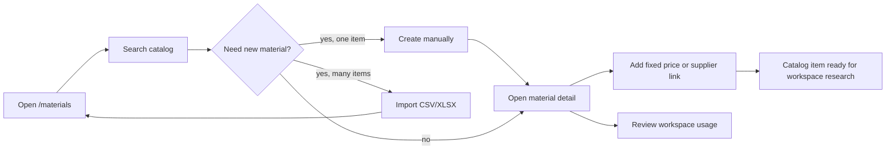
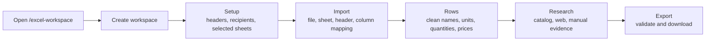
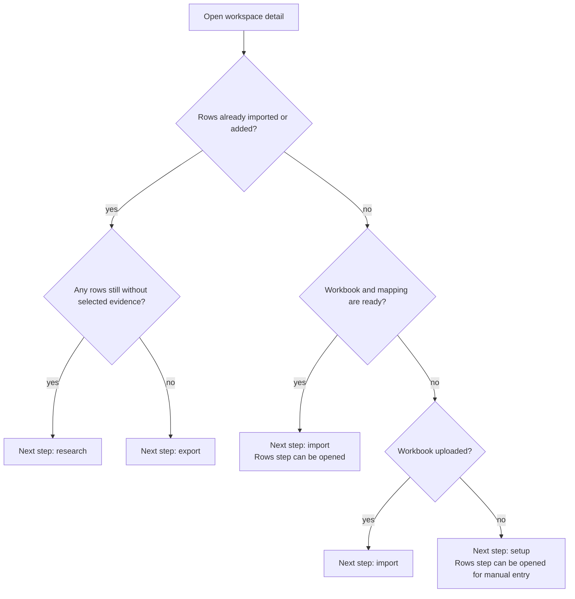
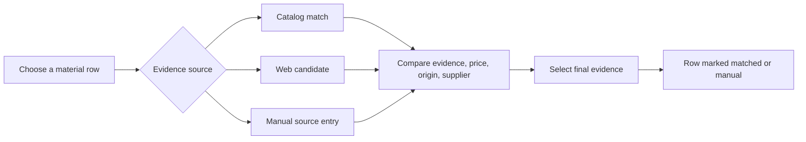
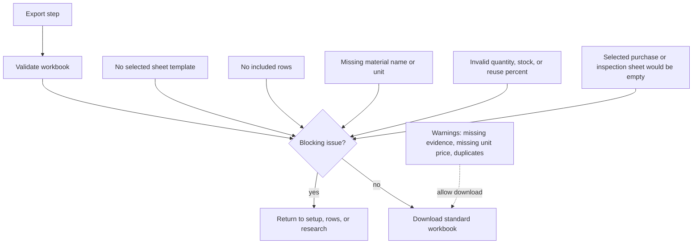
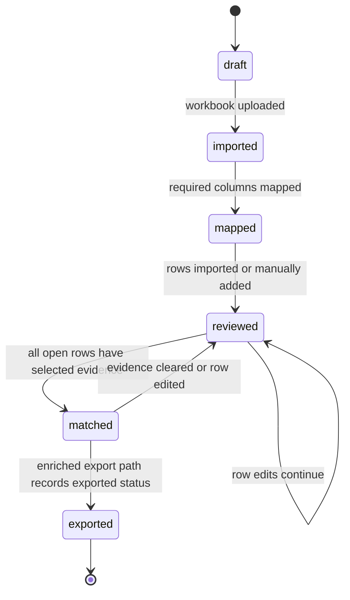

# Workflow 02 - Excel Workspace Material Sourcing

## Goal

Turn a material workbook or manually entered material list into a reviewed
standard workbook with catalog links, source evidence, and export-ready sheets.

Target flow:

`prepare catalog -> create workspace -> configure workbook -> import or add rows -> review rows -> research sources -> select evidence -> validate -> export`

## Users

- Procurement or operations staff preparing material workbooks.
- Reviewers checking quantities, prices, and source evidence.
- Analysts maintaining the internal material catalog.

## Entry Points

- `/materials` for the internal material catalog.
- `/materials/new` for one-off catalog creation.
- `/materials/import` for bulk catalog import.
- `/materials/[id]` for material detail, price links, and workspace usage.
- `/excel-workspace` for workspace list and creation.
- `/excel-workspace/[id]?step=setup|import|rows|research|export` for the
  guided workbook flow.

## Overall Flow

```mermaid
flowchart LR
  catalog["Prepare material catalog"]
  workspace["Create or open Excel Workspace"]
  setup["Setup headers and selected sheets"]
  import["Upload workbook or add rows"]
  rows["Review and edit material rows"]
  research["Find source evidence"]
  select["Select catalog, web, or manual evidence"]
  validate["Validate export requirements"]
  export["Download workbook"]

  catalog --> workspace --> setup --> import --> rows --> research --> select --> validate --> export
```

## Material Catalog Flow

## Workspace Step Flow

## Workspace Navigation Flow

## Research Flow

## Export Gate

## Status Diagram

## Standard Workbook Output

The standard workbook can include these sheets, depending on the user's setup:

- THVT summary.
- Purchase request.
- Inspection term 1.
- Inspection term 2.
- Evidence.

## Completion Point

The workflow is complete when the user downloads a validated workbook and any
remaining warnings are understood or accepted.

## Exceptions

- Workbook has many sheets: user must choose the sheet explicitly.
- Header row is ambiguous: user reviews and adjusts the header row.
- Required mapping is missing: import waits until the material-name mapping is
  available.
- Source search fails: user can use catalog evidence or enter a manual source.
- Row is not needed for export: user excludes the row so it does not affect the
  workbook.
