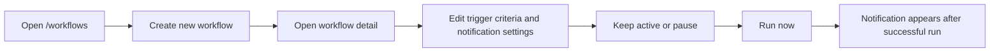
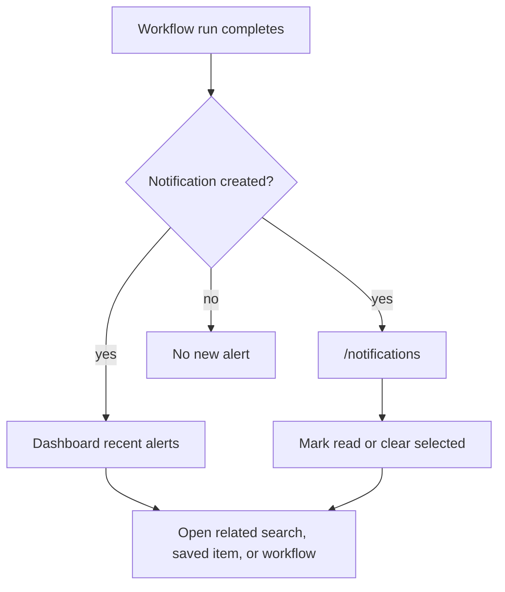
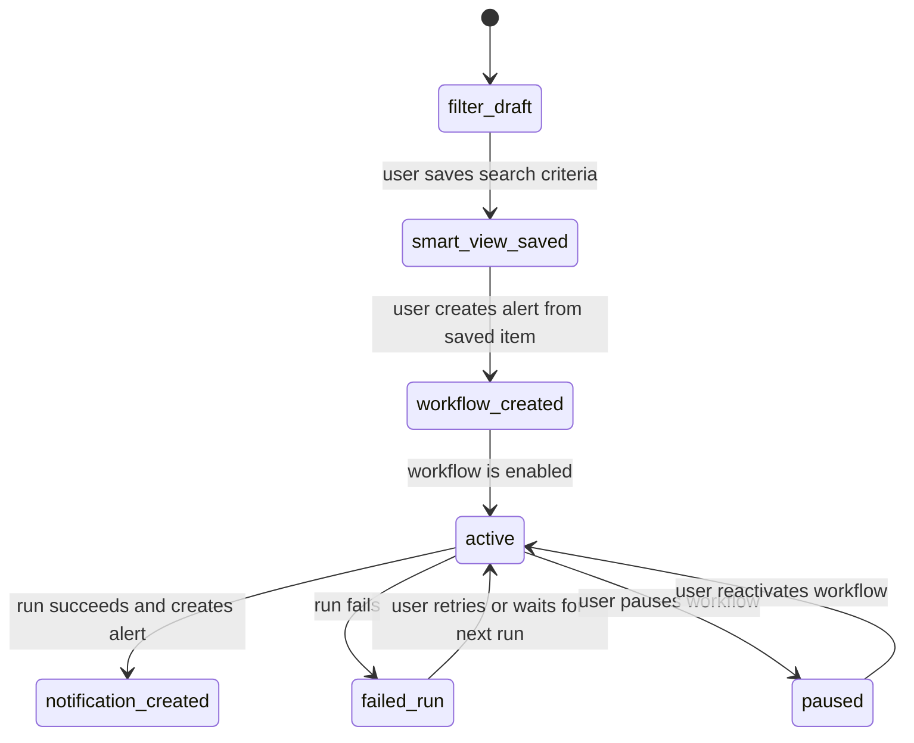

# Workflow 03 - Smart Filter Alert Automation

## Goal

Let users save a tender-search filter as a Smart View, turn it into an active
alert workflow, and receive notifications when the workflow runs.

Target flow:

`search -> refine filter -> save smart view -> open saved items -> create alert workflow -> run or wait -> receive notification`

## Users

- Tender specialist monitoring new opportunities.
- Business manager watching selected markets or locations.
- Operations user standardizing reusable filters.

## Entry Points

- `/search` to create and save a Smart View.
- `/saved-items` to review saved filters and create alert workflows.
- `/workflows` to create, run, pause, and inspect workflows.
- `/notifications` to review generated notifications.
- `/dashboard` to see recent alerts and workflow health.

## Smart View to Alert Flow

```mermaid
flowchart LR
  search["Open /search"]
  criteria["Set mode, keyword, location, category, budget, date"]
  results["Review matching results"]
  save["Save as Smart View"]
  saved["Open /saved-items"]
  create["Create alert workflow from Smart View"]
  active["Workflow becomes active"]
  run["Run now or wait for next trigger"]
  notify["Notification is created"]
  review["Review in dashboard or notification center"]

  search --> criteria --> results --> save --> saved --> create --> active --> run --> notify --> review
```

## Manual Workflow Creation Flow

## Notification Review Flow

## Status Diagram

## Completion Point

The workflow is complete when the saved filter has an active alert workflow and
the user can see the latest run outcome and notification trail.

## Exceptions

- Filter is too broad: user narrows the criteria before enabling regular
  alerts.
- Saved filter is outdated: user returns to search, edits the criteria, and
  saves again.
- Workflow is paused: no future runs happen until reactivated.
- Run fails: user sees the failure message in workflow history and can retry.
- Duplicate opportunity appears again: user relies on source id or source URL to
  avoid treating it as a new item.
