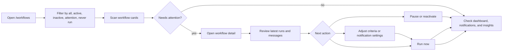
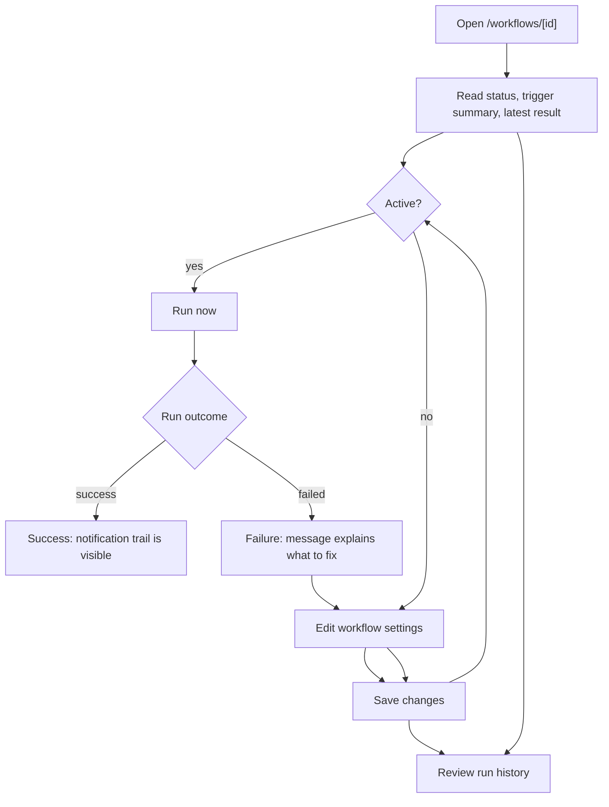
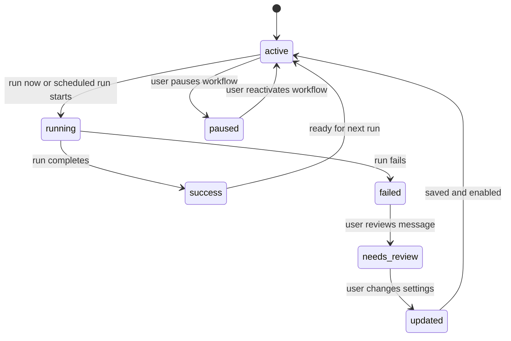

# Workflow 04 - Monitor, Optimize, and Audit Workflows

## Goal

Give users a clear loop for checking workflow health, fixing noisy rules,
rerunning workflows, and auditing recent outcomes.

Target flow:

`workflows -> filter status -> inspect detail -> review runs -> adjust settings -> rerun -> monitor dashboard`

## Users

- Tender specialist maintaining personal alert workflows.
- Operations user checking alert reliability.
- QA or product reviewer validating behavior before rollout.

## Entry Points

- `/workflows` for workflow cards, filters, create, pause, and run actions.
- `/workflows/[id]` for detail, editing, run history, and manual run.
- `/dashboard` for active workflow count and recent alerts.
- `/insights` for aggregate health signals.
- `/notifications` for alert follow-up.

## Monitoring Flow

## Detail Page Flow

## Status Diagram

## Health Review Checklist

- Active workflows have recent successful runs.
- Failed workflows expose a readable message.
- Paused workflows are intentionally paused.
- Never-run workflows are either newly created or need a manual run.
- Noisy workflows have narrower criteria or lower notification frequency.
- Recent notifications match the expected saved views and priorities.

## Completion Point

The workflow is complete when the user has either confirmed the workflow is
healthy, paused it intentionally, or updated it and verified a new run outcome.

## Exceptions

- Workflow is inactive: run action stays blocked until the user reactivates it.
- Source problem causes failure: keep the workflow available, but mark the run
  for review.
- Workflow is too noisy: narrow criteria or reduce alert frequency.
- Edit is invalid: block save until the field issue is fixed.
- Run creates no useful alert: review criteria before waiting for the next run.
